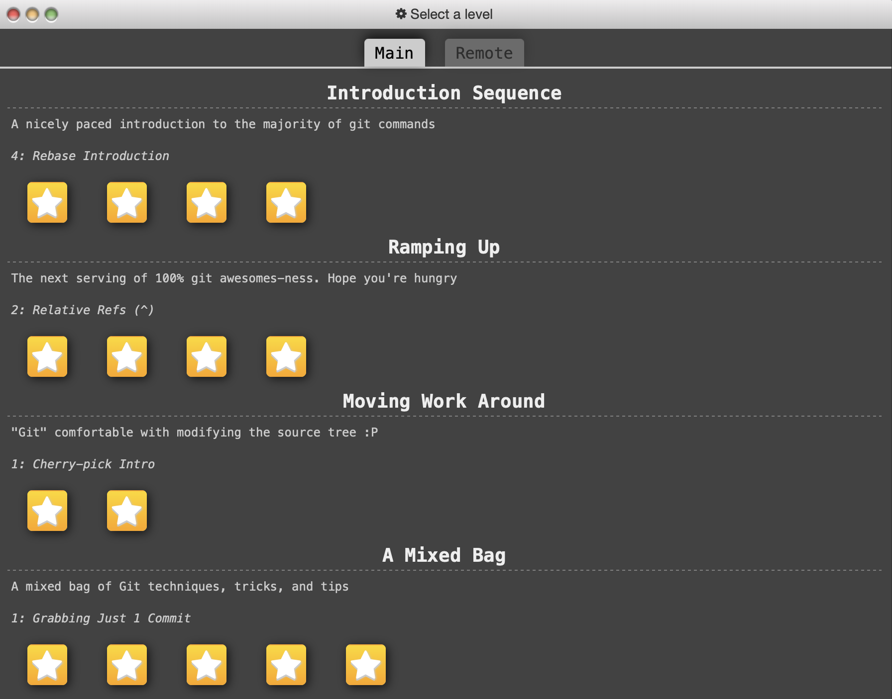
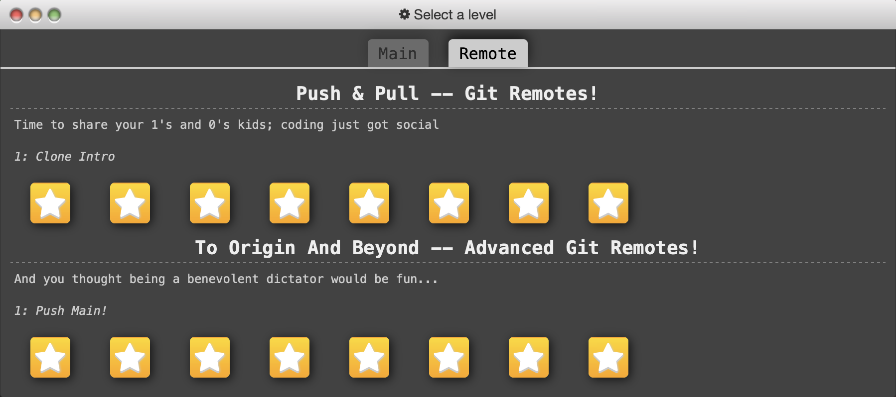

# Laboratorio 2: Control de versiones y documentación automática <!-- omit from toc -->

 
  
Tabla de contenidos

- [Parte 1 – Git y control de versiones](#parte-1--git-y-control-de-versiones)
  - [Trabajo local](#trabajo-local)
    - [`git commit`](#git-commit)
    - [`git commit --amend`](#git-commit---amend)
    - [`git reset`](#git-reset)
    - [`git revert`](#git-revert)
  - [Ramas e historial](#ramas-e-historial)
    - [`git branch`](#git-branch)
    - [`git branch -f`](#git-branch--f)
    - [`git checkout` (modo detached)](#git-checkout-modo-detached)
    - [Referencias relativas (`~` y `^`)](#referencias-relativas--y-)
    - [`git rebase`](#git-rebase)
    - [`git rebase -i`](#git-rebase--i)
    - [`git cherry-pick`](#git-cherry-pick)
  - [Colaboración remota](#colaboración-remota)
    - [`git push`](#git-push)
    - [`git pull`](#git-pull)
    - [`git fetch`](#git-fetch)
  - [Versionado](#versionado)
    - [`git tag`](#git-tag)
    - [`git describe`](#git-describe)
- [Parte 2 – Documentación automática en C++ y Python](#parte-2--documentación-automática-en-c-y-python)
- [Proyecto en C++: Sistema de Inventario de Ferretería](#proyecto-en-c-sistema-de-inventario-de-ferretería)
  - [Descripción](#descripción)
  - [Funcionamiento](#funcionamiento)
  - [Estructura del código](#estructura-del-código)
  - [Documentación](#documentación)
- [Proyecto en Python: Gestor de Tareas Personales](#proyecto-en-python-gestor-de-tareas-personales)
  - [Descripción](#descripción-1)
  - [Funcionamiento](#funcionamiento-1)
  - [Estructura del código](#estructura-del-código-1)
  - [Documentación](#documentación-1)
- [Experiencia utilizando Doxygen y Sphinx](#experiencia-utilizando-doxygen-y-sphinx)

 

Este laboratorio del curso IE-0417 se basa en el aprendizaje profundo de Git como sistema de control de versiones distribuido y la documentación automática en C++ y Python.
Por lo tanto, se encuentra dividido en estas dos secciones desarrolladas a continuación.

## Parte 1 – Git y control de versiones

En esta sección, se describen los principales comandos utilizados en el tutorial de [`learngitbranching`](https://learngitbranching.js.org), dividos en:

- Trabajo local
- Branches e historial
- Colaboración remota
- Versionado

Sin embargo, primero se adjuntan capturas de pantalla que evidencian que se completó el tutorial en cuestión.
Se requería completar las siguientes secciones: 

- *Introduction Sequence*
- *Ramping Up*
- *Moving Work Around*
- *A Mixed Bag*
- *Push & Pull -- Git Remotes!*
- *To Origin And Beyond -- Advanced Git Remotes!*

  

  

En las dos imágenes anteriores, se evidencia que se completó cada nivel con la mínima cantidad de comandos (según en la página web).
Por esta razón, es que se muestran las estrellas en cada nivel.
Únicamente, no era requerido completar la sección de *Advanced Topics*.

Con la evidencia presentada, se procede a documentar brevemente los comandos vistos.

### Trabajo local

#### `git commit`

Crea un *snapshot* del proyecto en un momento determinado.

#### `git commit --amend`

Permite modificar el último commit.
Úsese únicamente si ese commit no ha sido compartido aún.

#### `git reset`

Mueve la rama actual a otro commit.
- `--soft`: conserva el staging.
- `--mixed` (por defecto): conserva los archivos pero limpia el staging.
- `--hard`: descarta todo.

#### `git revert`

Revierte un commit creando uno nuevo que deshace sus cambios, sin alterar el historial.

### Ramas e historial

#### `git branch`

Crea un puntero a un commit.
Las ramas son livianas (en cuanto a memoria), por lo que conviene crear varias para organizar mejor el trabajo.

#### `git branch -f`

Fuerza el puntero de una rama para que apunte a otro commit, sin cambiar su contenido.

#### `git checkout` (modo detached)

Permite moverse a un commit específico sin estar en una rama.
Ideal para inspeccionar versiones sin alterar ramas.

#### Referencias relativas (`~` y `^`)

- `HEAD~n`: *n* commits hacia atrás en línea recta.
- `HEAD^n`: commit padre *n*.

#### `git rebase`

Reaplica commits sobre una nueva base para mantener el historial limpio y lineal.

#### `git rebase -i`

Rebase interactivo, pues permite editar, reordenar, combinar o eliminar commits.

#### `git cherry-pick`

Permite aplicar un commit específico (de otra rama) sobre la rama actual.

### Colaboración remota

#### `git push`

Envía cambios locales al repositorio remoto.
Sintaxis: `git push <remoto> <local>:<remoto>`, donde `<local>` y `<remoto>` son branches.

#### `git pull`

Descarga y fusiona los cambios del remoto con la rama actual. Es una combinación entre `merge` y `fetch`.

Ejemplo: `git pull origin main`

#### `git fetch`

Descarga los cambios remotos sin aplicarlos.
Permite revisarlos antes de mezclar.

### Versionado

#### `git tag`

Crea una etiqueta en un commit, normalmente usada para marcar versiones importantes (*releases* por ejemplo).

#### `git describe`

Muestra una descripción basada en la etiqueta más cercana y el número de commits desde ella.

---

## Parte 2 – Documentación automática en C++ y Python

Para esta sección, se desarrollaron dos proyectos para la generación de documentación automática, por medio de las herramientas **`Doxygen`** y **`Sphinx`** en C++ y Python, respectivamente.

## Proyecto en C++: Sistema de Inventario de Ferretería

### Descripción

El proyecto implementa un sistema sencillo de gestión de inventario para una ferretería.
Permite agregar productos, eliminarlos, actualizar sus cantidades y buscar por categoría.

Incluye las siguientes funcionalidades:

- Manejo de productos (clase `Producto`).
- Operaciones sobre el inventario (clase `Inventario`).
- Menú interactivo para agregar, eliminar, actualizar cantidades y buscar productos por categoría.

### Funcionamiento

El programa ofrece una interfaz en la terminal con un menú interactivo que guía al usuario en la administración del inventario.
Los productos son almacenados en memoria mediante un `std::vector`.

### Estructura del código

- `producto.hpp` / `producto.cpp`: Define la clase `Producto`, que contiene atributos como ID, nombre, categoría, cantidad y precio.

- `inventario.hpp` / `inventario.cpp`: Define la clase `Inventario`, que permite operaciones sobre múltiples productos.

- `main.cpp`: Interfaz de usuario con un menú para manipular el inventario.

- `Doxyfile`: Archivo de configuración para generar la documentación con Doxygen.

### Documentación

La documentación generada con la herramienta Doxygen se encuentra en el enlace a continuación: [Ver documentación](https://laboratorio2-doxygen-ie0417.netlify.app)

En la barra lateral izquierda, se accede a la documentación por clases o por archivos.

## Proyecto en Python: Gestor de Tareas Personales

### Descripción

Este proyecto implementa un sistema de gestión de tareas y proyectos personales, desde la terminal.
Permite:

- Crear tareas
- Marcar tareas como completadas
- Consultar tareas vencidas o pendientes

### Funcionamiento

Al ejecutar el programa principal, se inicia un menú que solicita al usuario crear o consultar tareas.
Las tareas tienen una fecha límite y un estado de finalización, y se gestionan en memoria (no son almacenadas en un archivo fuera del programa por simplificidad).

### Estructura del código

- `tarea.py`: Define la clase `Tarea` con atributos como título, descripción, fecha límite y estado.

- `proyecto.py`: Define la clase `Proyecto`, que contiene y organiza un conjunto de tareas.

- `main.py`: Proporciona un menú interactivo desde la terminal.

- `docs/`: Carpeta que contiene los archivos de configuración y fuente de Sphinx, incluyendo `conf.py` e `index.rst` para la generación del html.

### Documentación

La documentación generada con la herramienta Sphinx se encuentra en el enlace a continuación: [Ver documentación](https://laboratorio2-sphinx-ie0417.netlify.app/)

## Experiencia utilizando Doxygen y Sphinx

- **Doxygen** permite una generación rápida de documentación en C++ mientras el código esté bien comentado (según el formato requerido para procesar la documentación). La generación automática por medio de un `Doxyfile` fue clara y sencilla de realizar.
- **Sphinx** es una herramienta amplia y con muchas funcionalidades para Python, especialmente porque permite el uso de extensiones para ampliar su alcance. Requiere de configuración inicial, pero el resultado es profesional y fácil de navegar.
- Ambas herramientas fomentan la escritura de código limpio y bien documentado.

