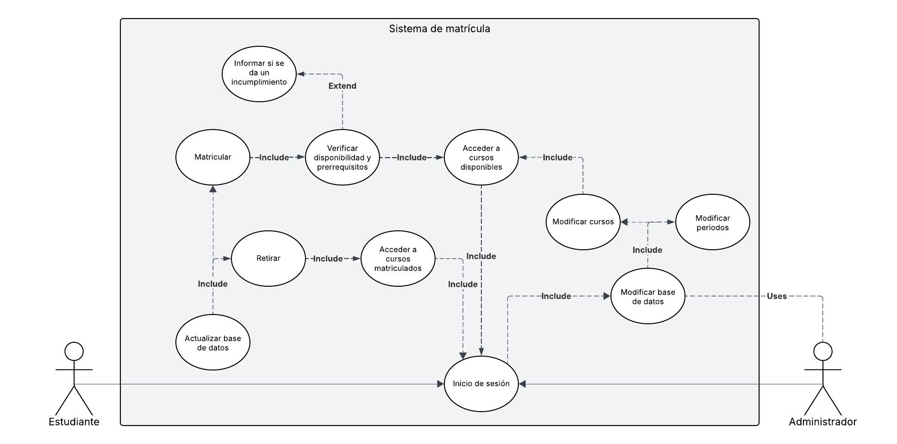

# Laboratorio 3: Sistema de Inscripción a Cursos Universitarios

En este laboratorio del curso IE-0417, se solicita realizar aplicar técnicas de análisis de requerimientos y modelado de casos de uso con profundidad profesional.
Se seleccionó el tema de: **Sistema de Inscripción a Cursos Universitarios**.

**Integrantes del grupo**
- Diego Alfaro (C20259)
- Edgar Alvarado (C10351)
- Carlos Moya (C15346)
- Daniel Sáenz (C37099)

## Suposiciones

Primeramente, se listan las suposiciones realizadas para el sistema de software diseñado.
Estos se muestran a continuación:

- El sistema se comunica con el sistema de base de datos institucional, donde almacena la información de los estudiantes (carrera, cursos aprobados, cursos matriculados) y de los cursos (horario, cupo, prerrequisitos).
- Al realizar el inicio de sesión en el sistema, se puede escoger entre un módulo de matrícula o uno para visualizar los cursos ya matriculados.

## Requerimientos

### Requerimientos funcionales

1. Permitir al usuario autenticarse con usuario y contraseña.
2. Permitir al estudiante matricularse o desmatricularse de cursos durante el período de matrícula.
3. Permitir a los administradores abrir y cerrar períodos de matrícula.
4. Validar los prerrequisitos de los cursos antes de permitir la inscripción.
5. Permitir al estudiante visualizar los cursos matriculados.

### Requerimientos no funcionales

1. Las contraseñas deben estar protegidas de forma encriptada al ser enviadas y almacenadas de forma hasheada.
2. El sistema debe responder en un tiempo no mayor a 2 segundos por operación.
3. La disponibilidad del sistema debe ser al menos del 99% durante el período de matrícula.

### Requerimientos técnicos

1. El sistema debe ser accesible desde navegadores como Chrome, Firefox y Microsoft Edge.
2. El sistema debe integrarse con el sistema de base de datos institucional a través de una API REST.

## Casos de Uso

### Caso de Uso 1: Inscribirse en un Curso

**Actor Principal:** Estudiante

**Precondiciones:**
- El estudiante debe estar autenticado.
- El período de matrícula debe estar abierto.

**Postcondiciones:**
- El curso aparece en el horario del estudiante.
- Se actualiza el cupo disponible del curso.

**Flujo Principal:**
1. El estudiante accede al módulo de matrícula.
2. Elige un curso disponible.
3. El sistema verifica si cumple los prerrequisitos.
4. El sistema verifica si hay cupo disponible y no hay choque de horarios.
5. El estudiante confirma la inscripción.
6. El sistema registra la matrícula.

**Flujos Alternativos:**
- 3A. Si no cumple los prerrequisitos, el sistema muestra un mensaje de error y se cancela la inscripción.
- 4A. Si no hay cupo o hay conflicto de horario, el sistema impide la inscripción y lo notifica.

### Caso de Uso 2: Retirar Curso

**Actor Principal:** Estudiante

**Precondiciones:**
- El estudiante ha iniciado sesión correctamente.
- El curso a retirar está dentro del período permitido para modificaciones.
- El curso está dentro de los matriculados para el estudiante.

**Postcondiciones:**
- El curso es eliminado de la carga académica del estudiante.
- El cupo del curso es actualizado en la base de datos.

**Flujo Principal:**
1. El estudiante accede a la sección de cursos inscritos.
2. Selecciona el curso que desea retirar.
3. Confirma la acción.
4. El sistema elimina la relación curso-estudiante en la base de datos.
5. El sistema actualiza el cupo disponible del curso.
6. El sistema muestra una confirmación al estudiante.

**Flujos Alternativos:**
- 2A. Si el período de modificación ha terminado, se muestra un mensaje informando que ya no se pueden hacer cambios.

## Diagrama UML del Sistema

Primero, se muestra el diagrama UML diseñado a continuación:

  

Luego, se describen los principales componentes del diagrama.

### Actores

- **Estudiante:**  
  Actor principal. Interactúa con los casos de uso: Matricular, Retirar, Acceder a cursos disponibles, Acceder a cursos matriculados e Inicio de sesión.

- **Administrador:**  
  Actor que hereda del estudiante. Puede realizar todas las acciones del estudiante, además de funciones como: Modificar base de datos, Modificar cursos y Modificar periodos.

**Generalización de actores:**  
El administrador hereda las funcionalidades del estudiante, y además accede a funcionalidades administrativas específicas.

## Casos de Uso Principales

- Matricular
- Retirar
- Acceder a cursos disponibles
- Acceder a cursos matriculados
- Inicio de sesión
- Modificar cursos / periodos / base de datos (sólo para administrador)

## Relaciones «include»

Estas representan funcionalidad obligatoria y compartida entre varios casos de uso.
Se utilizan para dividir lógica común en subfunciones reutilizables.

**Ejemplos:**
- Matricular → incluye → Verificar disponibilidad y prerrequisitos.
- Verificar disponibilidad y prerrequisitos → incluye → Acceder a cursos disponibles.
- Matricular y Retirar → incluyen → Actualizar base de datos.
- Modificar cursos → incluye → Modificar base de datos.
- Múltiples actores → incluyen → Inicio de sesión.

## Relaciones «extend»

Estas representan comportamientos opcionales que se ejecutan bajo ciertas condiciones.

**Ejemplo:**
- Verificar disponibilidad y prerrequisitos → extiende → Informar si se da un incumplimiento.

Esta extensión se activa únicamente si el estudiante no cumple con los requisitos del curso.
