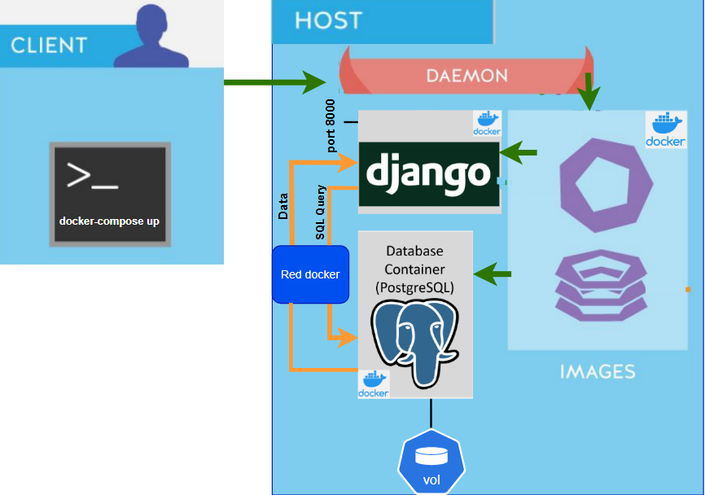
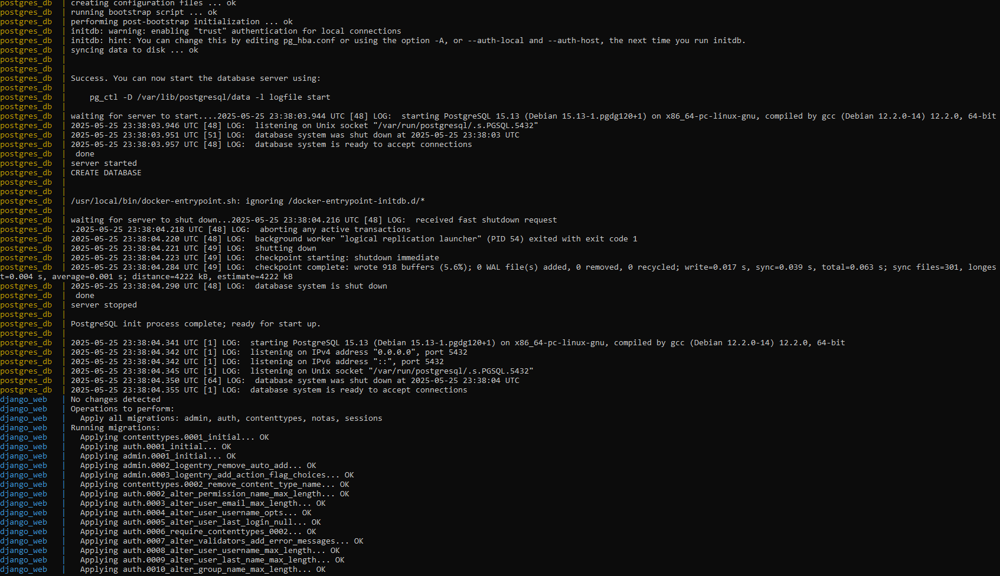
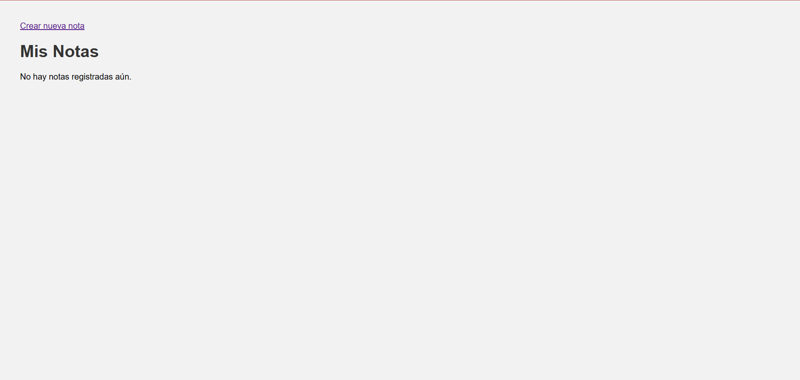
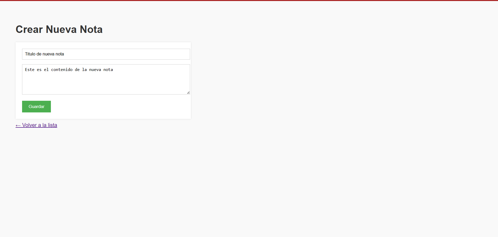
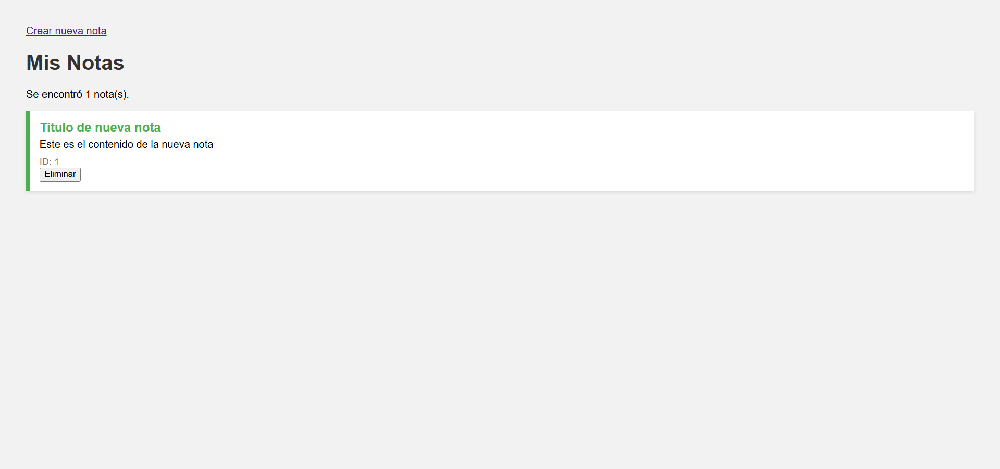
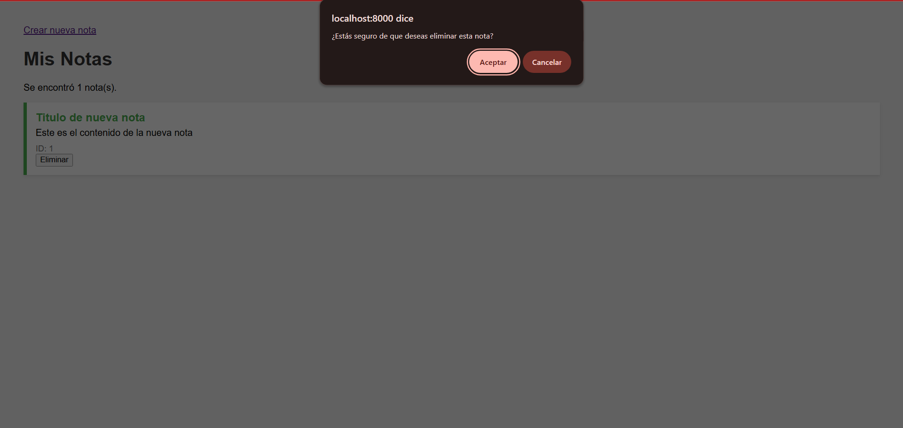

# 🐳 Laboratorio 5 -  Despliegue de una aplicación Django con Docker

**Estudiantes:**
 
- Oscar Francisco Rojas Rojas — C36953
- Daniel Alberto Sáenz Obando — C37099

---

Este laboratorio consiste en el despliegue de una aplicación Django utilizando contenedores Docker, permitiendo abstraer la configuración del entorno de desarrollo y asegurar la portabilidad del sistema.
La solución está diseñada para levantar tanto el backend de Django como una base de datos PostgreSQL, utilizando `docker-compose` para orquestar ambos servicios y gestionar su comunicación a través de una red Docker personalizada.

Se implementa un volumen persistente en el contenedor de la base de datos para garantizar que los datos no se pierdan aunque el contenedor se reinicie o se reconstruya.
Además, se hace uso de variables de entorno definidas en un archivo `.env` para evitar exponer credenciales sensibles y facilitar la configuración del entorno.

---

## Instrucciones para ejecución desde cero

1. **Clonar el repositorio.**

2. **Generación de la SECRET_KEY**

El archivo `.env` contiene el espacio para una variable fundamental para el funcionamiento seguro de la aplicación Django: el `SECRET_KEY`.

Si esta clave se ve comprometida, un atacante podría generar tokens o cookies falsos que Django aceptaría como válidos, lo cual representa un riesgo grave de seguridad.
Por esta razón, es esencial que el `SECRET_KEY` no esté codificado directamente en el proyecto.

Para generar la clave, se utiliza este comando:

```bash
python -c "from django.core.management.utils import get_random_secret_key; print(get_random_secret_key())"
```

Observe que es un requisito tener instalado el paquete Django, ya sea en un entorno virtual (venv) o a nivel de sistema, para ejecutar el comando de generación de la clave.

La clave generada se debe ingresar en el archivo `.env` (incluir las comillas):

```env
SECRET_KEY='<clave_generada>'
```

3. **Construir y levantar los contenedores y servicios**:

Para este paso, es necesario activar el _docker daemon_ o abrir la aplicación de Docker Desktop.
Luego, se ejecuta el siguiente comando en la terminal:

```bash
docker-compose up
```

4. **Abrir el navegador**: [http://localhost:8000](http://localhost:8000)

### Comandos utilizados para la creación del proyecto

Para la creación del proyecto en Django, se utilizó el comando a continuación:

```bash
django-admin startproject config .
```

A este se le denominó `config` y se creó en el directorio del laboratorio.
Luego, se creó la aplicación de notas con el siguiente comando.

```bash
python manage.py startapp notas
```

---

## Contenedores y Arquitectura

La arquitectura del sistema se basa en una solución de contenedores Docker, utilizando `docker-compose` para orquestar múltiples servicios que trabajan de manera conjunta.
Esta configuración permite separar las responsabilidades, simplificar el despliegue y asegurar la portabilidad del entorno entre distintos equipos o plataformas.

- **web**: Servicio Django basado en una imagen personalizada con `Dockerfile`.
- **db**: Servicio PostgreSQL, con volumen persistente y red compartida.

Ambos contenedores están conectados a través de una red personalizada de Docker llamada django_net, lo que permite que se comuniquen directamente usando sus nombres de servicio.
Por ejemplo, Django puede conectarse a PostgreSQL utilizando el nombre `db` como host en la configuración, en lugar de una dirección IP.

El diagrama de la arquitectura de la arquitectura del sistema se muestra en la siguiente imagen:

<div align="center">
  <p>
    
  </p>
</div>

---

## Descripción de archivos clave

### `Dockerfile`

El archivo `Dockerfile` se encarga de definir la imagen personalizada que se utilizará para ejecutar la aplicación Django dentro de un contenedor.

En este caso, se parte de una imagen oficial de Python en su versión 3.11, lo que garantiza un entorno limpio y actualizado. El archivo establece `/app` como directorio de trabajo dentro del contenedor, luego copia el archivo `requirements.txt` y procede a instalar las dependencias necesarias con `pip`.

Posteriormente, copia el resto del proyecto al contenedor, expone el puerto 8000 para permitir el acceso a la aplicación desde el exterior y, finalmente, especifica el comando que debe ejecutarse al iniciar el contenedor.
Este comando aplica automáticamente las migraciones de Django y arranca el servidor de desarrollo, permitiendo que la aplicación esté disponible en la dirección 0.0.0.0:8000.

```dockerfile
# Usa una imagen oficial de Python
FROM python:3.11-slim

# Establece el directorio de trabajo
WORKDIR /app

# Copia los archivos
COPY requirements.txt .

# Instala dependencias
RUN pip install --no-cache-dir -r requirements.txt

# Copia el resto del proyecto
COPY . .

# Expone el puerto 8000 (usado con Django)
EXPOSE 8000

# Comando para ejecutar las migraciones automáticamente y levantar el contenedor
CMD ["sh", "-c", "python manage.py migrate && python manage.py runserver 0.0.0.0:8000"]
```

### `docker-compose.yml`

El archivo `docker-compose.yml` permite orquestar múltiples contenedores como parte de un sólo servicio integrado.
Define dos servicios principales: uno llamado `db`, encargado de ejecutar una instancia de PostgreSQL, y otro llamado `web`, que corresponde a la aplicación Django.

El servicio de base de datos se configura con variables de entorno cargadas desde un archivo `.env`, y utiliza un volumen persistente (`postgres_data`) para garantizar que los datos no se pierdan aunque el contenedor se reinicie o se elimine.
Por su parte, el servicio web construye la imagen a partir del `Dockerfile`, monta el código del proyecto como un volumen, y ejecuta los comandos necesarios para preparar y lanzar la aplicación.

Ambos servicios están conectados a una red compartida llamada `django_net`, lo cual permite que Django se comunique correctamente con la base de datos a través de su nombre de servicio (`db`).

```yaml
services:
  db:
    image: postgres:15
    container_name: postgres_db
    env_file:
      - .env
    volumes:
      - postgres_data:/var/lib/postgresql/data
    networks:
      - django_net

  web:
    build: .
    container_name: django_web
    command: sh -c "python manage.py makemigrations && python manage.py migrate && python manage.py runserver 0.0.0.0:8000"
    volumes:
      - .:/app
    ports:
      - "8000:8000"
    depends_on:
      - db
    env_file:
      - .env
    networks:
      - django_net

volumes:
  postgres_data:

networks:
  django_net:
```

### `requirements.txt`

El archivo `requirements.txt` contiene la lista de dependencias que necesita la aplicación para ejecutarse correctamente.
Entre las principales se encuentra `Django`, que es el framework base del proyecto, y `psycopg2-binary`, que es el adaptador necesario para que Django pueda comunicarse con bases de datos PostgreSQL.

También se incluyen otras librerías requeridas por Django para su funcionamiento interno, como `asgiref` y `sqlparse`.
Este archivo es utilizado tanto dentro del contenedor durante la construcción de la imagen, como en entornos locales para garantizar que todas las dependencias sean instaladas correctamente y de forma uniforme.

```txt
asgiref==3.8.1
Django==4.2
psycopg2-binary==2.9.10
sqlparse==0.5.3
```

### `.env`

El archivo `.env` almacena variables de entorno que contienen información sensible o de configuración que no se desea codificar directamente en los archivos del proyecto.
Entre estas variables se incluyen el nombre de la base de datos, el usuario, la contraseña, el host, el puerto y la `SECRET_KEY` necesaria para la seguridad interna de Django.

Este archivo es cargado automáticamente por docker-compose y permite mantener las configuraciones organizadas, reutilizables y protegidas.
También facilita la portabilidad del proyecto, ya que cada persona o entorno puede tener su propio archivo `.env` con los valores necesarios, sin necesidad de modificar el código fuente.

```env
POSTGRES_DB=notasdb
POSTGRES_USER=admin
POSTGRES_PASSWORD=admin123
DB_HOST=db
DB_PORT=5432
SECRET_KEY=<key_generada>
```

---

## Demostración del funcionamiento

Al ejecutar construir y levantar los servicios, se conectan de forma exitosa todos los componentes de la red.
También, se realizan las migraciones necesarias.

<div align="center">
  <p>
    
  </p>
</div>


Una vez levantado el entorno, la aplicación estará disponible en `localhost:8000`.
Desde ahí se puede acceder a las vistas implementadas en la app `notas`.

<div align="center">
  <p>
    
  </p>
</div>

La página puede crear notas:

<div align="center">
  <p>
    
  </p>
  <p>
    
  </p>
</div>

La página puede eliminar notas:
<div align="center">
  <p>
    
  </p>
</div>

---
