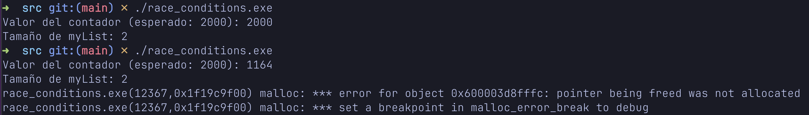
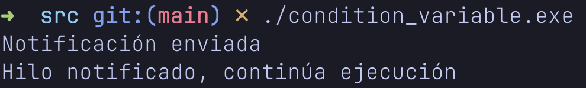
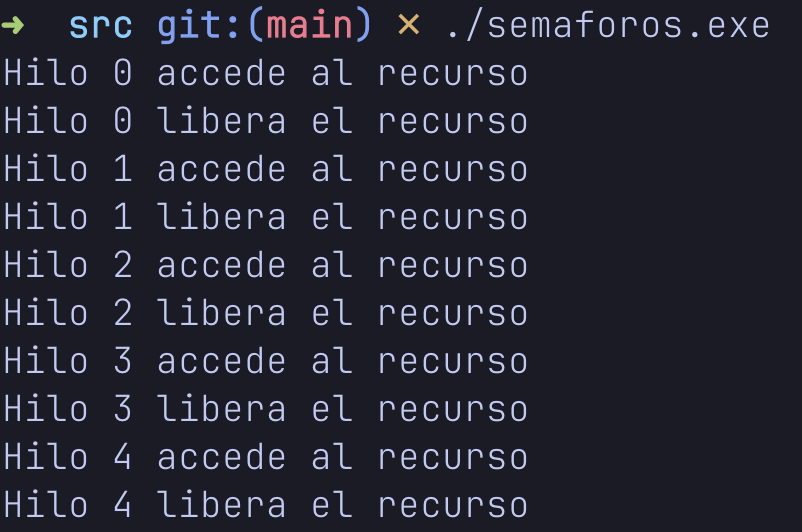
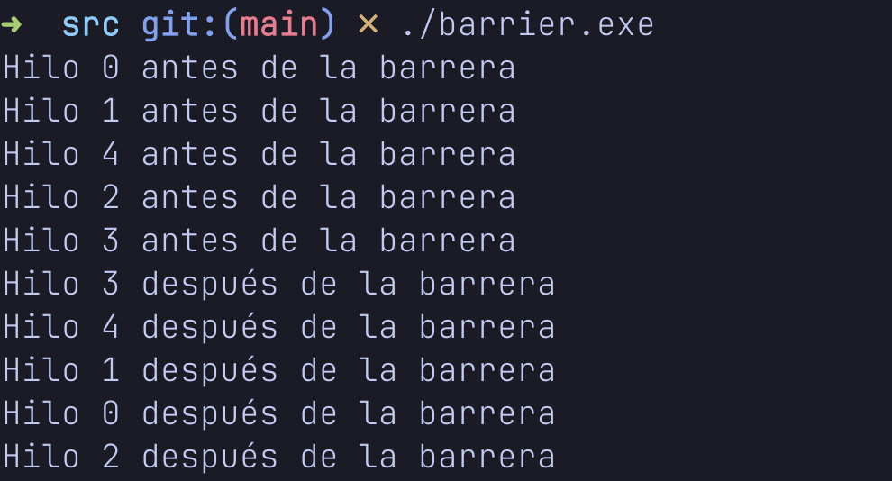
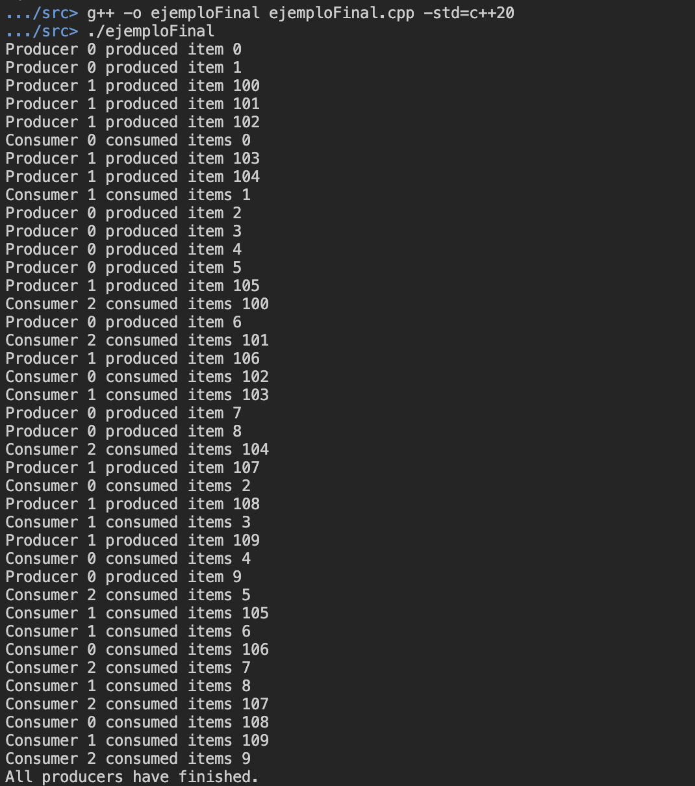

# Laboratorio 6

El presente directorio contiene los archivos correspondientes al laboratorio 6, que abarca los temas de programación paralela y concurrente. Cada archivo aborda un tema diferente como condiciones de carrera, exclusión mutua, variables de condición, semáforos, barreras y deadlocks.

---

## Contenido

| Archivo                  | Tema                               |
|--------------------------|------------------------------------|
| `mutex.cpp`              | Exclusión mutua con `std::mutex`   |
| `race_condition.cpp`     | Condición de carrera               |
| `condition_variable.cpp` | Uso de `std::condition_variable`   |
| `semaforos.cpp`          | Implementación de semáforos        |
| `barrier.cpp`            | Barreras de sincronización         |
| `deadlock.cpp`           | Ejemplo de interbloqueo (deadlock) |

---

## Modo de uso

Para compilar y ejecutar cualquiera de los ejemplos en este laboratorio, se puede usar el compilador `g++` con soporte para C++20 (o superior). Por ejemplo:

```bash
g++ -std=c++20 -o <nombre_archivo> <nombre_archivo>.cpp -pthread
```

Luego, para ejecutar

El comando anterior compila el programa y genera un ejecutable denominado. Para ejecutarlo, escriba el comando a continuación:

```shell
./<nombre_archivo>.exe
```


Asegúrese de compilar con `-pthread`, ya que se usan hilos (`std::thread`) en los ejemplos.

---


## Conceptos detallados en el laboratorio

Este laboratorio posee un gran componente teórico detrás del funcionamiento de la programación paralela y concurrente. Por lo tanto, a continuación se presenta un resumen de los principales conceptos tratados.

### Proceso (_Process_)

Una instancia de un programa en ejecución. Cada proceso tiene su __propio__ espacio de memoria.

- Independiente de otros procesos.
- Costoso en términos de recursos del sistema.
- Requiere de mecanismos como pipes, sockets o IPC (_Inter-process communication_) para comunicarse con otros procesos.
- Abarcan navegadores web, editores de texto, clientes de correo electrónico, entre otros.

### Hilo (_Thread_)

Una unidad de ejecución dentro de un proceso. Todos los hilos de un proceso __comparten__ el mismo espacio de memoria.

- Dependientes de los demás hilos de un proceso dado.
- Menos costoso que los procesos en cuanto a los recursos del sistema (comparten misma memoria).
- Pueden comunicarse directamente entre sí, a través de la memoria compartida. 
- Pueden ser cada pestaña de un navegador web, el autoguardado de un editor de texto, el renderizado en un juego, entre otros.

### Multitarea (_Time-sharing_)

Corresponde a la capacidad de un sistema operativo para ejecutar múltiples tareas (procesos) de manera __concurrente__.

Funcionan de manera que el sistema operativo proporciona un intervalo pequeño de tiempo (_quantum_) para que se ejecute la tarea, y va alternando entre tareas. Así, se logra el efecto de simultaneidad percibida por el usuario. Se mejora la utilización del CPU y la capacidad de respuesta del sistema.

- A nivel de procesos.
- Cada proceso tiene su propio espacio de memoria (como se mencionó anteriormente).
- Aislamiento entre cada proceso.
- Requiere mecanismos de comunicación específicos.
- Costo de creación/gestión alto para cada proceso.

En un sistema de un único núcleo, se realiza un _context switching_ donde el sistema operativo cambia rápidamente entre los hilos de un proceso (no es en paralelo).

### Diferencia entre paralelismo y concurrencia

__Paralelismo__: Implica la ejecución _simultánea_ de múltiples tareas. Típicamente en sistemas con múltiples núcleos de CPU, donde cada núcleo puede ejecutar
una tarea diferente al mismo tiempo.

- Procesamiento de imágenes.
- Simulaciones científicas.

__Concurrencia__: Es la capacidad de un sistema para manejar múltiples tareas en progreso al mismo tiempo. Las tareas pueden iniciarse, ejecutarse y completarse en intervalos
de tiempo superpuestos. No necesariamente se ejecutan de forma paralela, pero progresan de manera intercalada. Se busca que las tareas no interfieran entre sí.

- Servidor web: Maneja conexiones de múltiples clientes de forma intercalada.
- Interfaz de usuario: Responder al usuario con operaciones en segundo plano.

### Procesadores multinúcleo y multiprocesadores

__Multinúcleo__: Un único chip de CPU que contiene múltiples núcleos de procesamiento. Cada núcleo puede ejecutar instrucciones de manera independiente.

- Núcleos comparten memoria caché y otros recursos del chip.
- Permite el paralelismo real. Si se poseen `n` núcleos, se pueden ejecutar `n` hilos en paralelo.

__Multiprocesador__: Un sistema con múltiples chips de CPU (procesadores), cada uno con uno o más núcleos.

- Cada procesador tiene su propia memoria caché.
- Ideal para servidores y sistemas de alta disponibilidad.

### Memoria compartida y memoria distribuida

__Memoria compartida__: Arquitectura en la que múltiples núcleos o procesadores comparten el mismo espacio de memoria física.

- Comunicación entre hilos/procesos mediante variables compartidas.
- Mecanismos de sincronización para evitar condiciones de carrera (_race condition_).
- Ejemplo: Computadores personales con procesadores multinúcleo.

__Memoria distribuida__: Arquitectura en la que cada procesador o nodo tiene su propia memoria local y no comparte memoria física con otros.

- Comunicación entre nodos a través de una red, por medio de mensajes.
- Escalabilidad alta.
- Ejemplo: Sistemas de computación en clúster y arquitecturas de computación distribuida.

### Modelos de programación

__Modelo de memoria compartida__: Múltiples hilos o procesos comparten un espacio de memoria común y pueden comunicarse entre sí, a través de esta memoria compartida.

- Comunicación directa y rápida.
- Mecanismos de sincronización para evitar _race conditions_.
- Utilizado en sistemas con arquitecturas de memoria compartida, como procesadores multinúcleo.
- Ejemplos: Pthreads (biblioteca estándar de C/C++ para programación multihilo), OpenMP (API que soporta programación multiprocesador basada en memoria compartida).

__Modelo de paso de mensajes__: Los procesos se comunican entre sí enviando y recibiendo mensajes. Cada proceso tiene su propia memoria local y no comparte memoria con otros procesos.

- Comunicación explícita entre procesos mediante mensajes.
- No requiere sincronización pero puede ser más lento por sobrecarga de mensajes.
- Utilizado en arquitecturas de memoria distribuida.
- Ejemplos: MPI (Estándar en la programación paralela basado en el paso de mensajes), Actor Model (Modelo de concurrencia que trata a los actores como unidades fundamentales que se comunican por el envío de mensajes).

### Condiciones de carrera (_race conditions_)

Situación que ocurre cuando dos o más hilos o procesos __acceden a una memoria compartida al mismo tiempo__ y al menos uno de ellos está realizando una operación de escritura, lo que ocasiona resultados impredecibles y no deseados.

- __Resultados inesperados__: Cálculos incorrectos debido a la interferencia entre hilos/procesos.
- __Comportamiento no determinista__: La ejecución de un programa puede producir diferentes resultados en diferentes ejecuciones (no es reproducible), lo que dificulta la depuración.
- __Segfaults y corrupción de memoria__: Provocado por acceso concurrente no controlado. 
- __Vulnerabilidades de seguridad__: Explotadas por atacantes para realizar ataques de tiempo o acceso a recursos compartidos.

### Sincronización de hilo

Controla el acceso concurrente a recursos compartidos para asegurar que múltiples hilos o procesos no
interfieran entre sí, evitando así condiciones de carrera y otros problemas de concurrencia. De esta forma, se evitan los problemas mencionados en la subsección anterior.

Incluye el uso de `mutex`, `std::lock_guard` (en C++), semáforos, `std::condition_variable`, entre otros.

### Mecanismos de sincronización

__Mutex (_Mutual exclusion_)__: Permite a los hilos alternarse para acceder a una sección crítica del código, con el fin de que sólo un hilo a la vez pueda ejecutarla.

En el caso de C++, existen las siguientes funciones:
- `std::mutex`: Bloquea y desbloquea acceso a una sección crítica
- `std::lock_guard`: Asegura que el mutex se desbloquee automáticamente al salir del ámbito.

Observe un ejemplo de su uso en `./src/mutex.cpp`.

__Semáforos__: Un contador que controla el acceso a uno o más recursos compartidos, permitiendo que un número limitado de hilos accedan a la sección crítica al mismo tiempo.

En C++20, se pueden utiliza la función `std::counting_semaphore`.

Observe un ejemplo de su uso en `./src/semaforos.cpp`.

__Variables de condición__: Permiten que un hilo espere, hasta que otro hilo notifique que una condición particular se ha cumplido.

- `std::condition_variable`: Utilizado para esperar y notificar estos cambios.

Observe el ejemplo `./src/condition_variable.cpp`.

__Barreras de sincronización (_Barriers_)__: Grupo de hilos espera hasta que todos los hilos hayan alcanzado un punto de sincronización común.

- `std::barrier`: Sincroniza el grupo de hilos.

Observe el ejemplo `./src/barrier.cpp`.

### Bloqueos y deadlocks

__Bloqueo (_Lock_)__: Una situación en la que un hilo adquiere un recurso (como un `mutex`) y evita que otros hilos accedan a ese recurso hasta que sea liberado.

__Deadlock__: Una situación en la que dos o más hilos se bloquean mutuamente y ninguno puede continuar su ejecución. Se presenta una dependencia circular entre los hilos. 

Observe el ejemplo en `./src/ejemploFinal.cpp`.

### Costos asociados a la creación y administración de hilos

__Tiempo de creación__: Tiempo para crear un hilo desde su inicialización hasta que esté listo para ejecutar. Muchos hilos pueden causar retrasos en el inicio de una aplicación.

- Reservación de recursos (Pila, identificador del hilo, espacio de datos).
- Inicialización del contexto (registros de CPU, punteros de pila).

__Memoria utilizada__: La cantidad de memoria requerida para almacenar la información de cada hilo. Muchos hilos pueden agotar la memoria disponible.

- Pila del hilo (variables locales, direcciones de retorno).
- Estructuras de control del hilo.

__Context switching__: El proceso de guardar el estado de un hilo y restaurar el estado de otro para cambiar el contexto de ejecución en la CPU. El cambio frecuente de contexto puede reducir la eficiencia del CPU.

- Guardar componentes (registros de CPU, punteros, entre otros).
- Restauración del nuevo contexto.

__Sincronización__: La gestión de acceso concurrente a recursos compartidos para evitar _race conditions_ y garantizar la coherencia de los datos. Contención excesiva puede degradar excesivamente el rendimiento.

- Bloqueos (adquirir y liberar mutexes).
- Contención (retrasos cuando hilos intentan acceder a los mismos recursos).

### Consideraciones de rendimiento

__Número de hilos__: Se recomienda ajustar el número de hilos al número de núcleos de la CPU y la naturaleza de la tarea para equilibrar la carga y minimizar la contención.

__Granularidad de tareas__: Encontrar un equilibrio donde las tareas sean suficientemente grandes para amortizar el _overhead_ de administración (muchos cambios de contexto) pero suficientemente pequeñas para permitir una buena paralelización.

__Utilización de recursos__:

- CPU: Asegurarse que los hilos no la saturen.
- Memoria: Disponible para pilas de hilos y estructuras de control.
- I/O: Evitar bloqueos y mejorar la concurrencia.

__Planificación de hilos__:

- Optimizar el rendimiento de planificación y asignación de los hilos.
- Ajustar las prioridades de hilo para que las tareas críticas no sean interrumpidas frecuentemente.

__Herramientas de perfilado y análisis__:

- Identificar cuellos de botella para optimizar la gestión de hilos.
- Implementar sistemas de monitoreo para hilos en tiempo real.


## Demostración de ejecución

Para poder visualizar el funcionamiento de los conceptos explicados (como condición de carrera, exclusión mutua, semáforos, etc.), se agregaron funciones `main()` a las porciones de código que originalmente no la incluían.

A continuación, se muestran las capturas de pantalla de las ejecuciones:

- **`mutex.png`**: Se muestra el uso correcto de `std::mutex` para evitar condiciones de carrera. El contador final es el esperado.

<p align="center">
  
</p>

- **`race_condition.png`**: Se hicieron dos ejecuciones. En la primera parece funcionar, pero en la segunda se evidencia el error: el contador termina con un valor incorrecto, demostrando que hubo una condición de carrera.

<p align="center">
  
</p>

- **`condition_variable.png`**: Ejemplo funcional del uso de `std::condition_variable` para sincronizar el acceso a una sección crítica entre threads.

<p align="center">
  
</p>

- **`semaforos.png`**: Demostración del uso de semáforos implementados con `mutex` y `condition_variable`, simulando el control de acceso a recursos limitados.

<p align="center">
  
</p>

- **`deadlock.png`**: El programa se queda esperando, evidenciando un *deadlock*. Dos hilos esperan indefinidamente por recursos que el otro tiene bloqueado.

<p align="center">
  
</p>

- **`barrier.png`**: Se visualiza cómo varios hilos esperan en un punto común antes de continuar, usando una barrera para sincronización.

<p align="center">
  
</p>


- **`ejecucion.png`**: Ejecución del ejemplo final que combina múltiples conceptos de sincronización. Se observa el comportamiento sincronizado de varios hilos, coordinando el acceso a los recursos compartidos mediante mutexes, condiciones y semáforos. Sirve como cierre integrador del laboratorio.

<p align="center">
  
</p>

---
