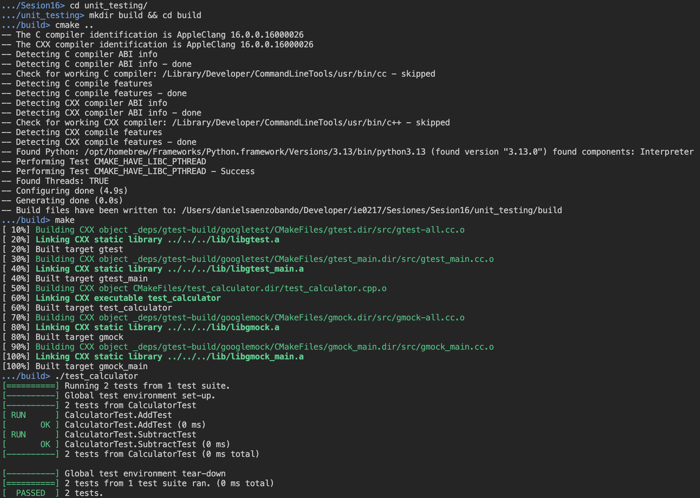
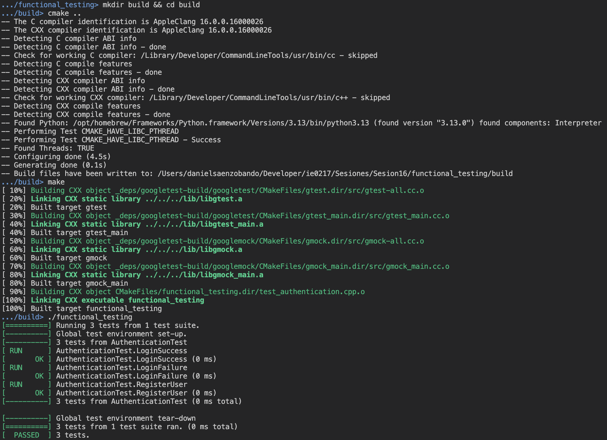
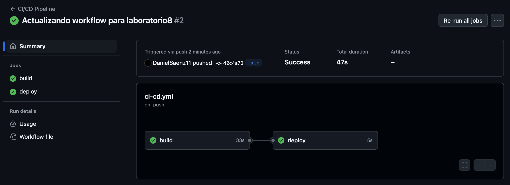

# Laboratorio 8

El presente directorio correponde al realizado para el laboratorio que consiste en el uso de herramientas de _software testing_.

## Modo de uso

A continuación, se muestra las instrucciones de compilación y ejecución de los códigos del laboratorio actual.

### Semilla

Para compilar el archivo de generación de números a partir de una semilla, utilice el siguiente comando de compilación:

```shell
g++ -o semilla.exe semilla.cpp
```

> [!NOTE]
> Debe de estar en la ruta `./ie0417/laboratorios/laboratorio8/` para que el comando anterior funcione correctamente.

Para la ejecución, se utiliza el comando:

```shell
./semilla.exe
```

### Unit Testing

Para manejar las referencias y compilación de este programa, se utiliza la herramienta `CMake`. Diríjase a la ruta `./ie0417/laboratorios/laboratorio8/unit_testing/` y ejecute el siguiente comando:

```shell
mkdir build && cd build
```

> [!NOTE]
> Este comando crea un directorio llamado build dentro de `unit_testing` y se cambia hacia ese directorio.

Ahora se ejecuta el `CMake` para construir el proyecto en cuestión con `GTest`. Utilice el siguiente comando para ello:

```shell
cmake ..
```

Ahora se ejecuta el Makefile creado para compilar el programa:

```shell
make
```

Finalmente, para ejecutar el archivo ejecutable con las pruebas unitarias para `Calculadora`, utilice el siguiente comando:

```shell
./test_calculator
```

### Functional Testing

De manera similar al programa anterior, se utilice la herramienta `CMake`, entonces diríjase a la ruta `./ie0417/laboratorios/laboratorio8/unit_testing/` y ejecute el siguiente comando:

```shell
mkdir build && cd build
```

Se ejecuta el `CMake` para construir el proyecto en cuestión con `GTest` y `GMock`. Utilice el siguiente comando para ello:

```shell
cmake ..
```

En este paso, se utiliza el Makefile para compilar el programa:

```shell
make
```

Para ejecutar el archivo resultante de la compilación y realizar los tests, se utiliza el archivo:

```shell
./functional_testing
```

> [!IMPORTANT]
> Observe que se están trabajando las rutas con `/`. Tenga presente que dependiendo del sistema operativo, es posible que requiera utilizar `\` (en el caso de Windows).

## Conceptos revisados

En esta sección, se tratan los conceptos detallados en el laboratorio, de forma teórica.

### Pruebas de software

_Software testing_ es el proceso de evaluar y verificar que un software funciona correctamente, de la forma planeada. Implica ejecutar un sistema para identificar cualquier brecha, error o falta de requisitos en comparación con los resultados reales esperados.

Se centra en mejorar la calidad del software, garantizar confiabilidad, seguridad y estabilidad en diferentes escenarios de uso del sistema.

### Semilla en software testing

Corresponde a un valor inicial utilizado en algoritmos generadores de números aleatorios para asegurar secuencias de números generados sean reproducibles, a partir de estas y así, poder analizar casos de ejecución específícos, con el fin de garantizar consistencia en el software.

- __Reproducibilidad__.
- __Control del entorno__.
- __Falicita el _debugging_:__ Permite recrear exactamente el estado de error del programa.
- __Documentación:__ A partir de la semilla, se puede realizar documentación, pues permite replicar pruebas (consistencia del software).

### Ciclo de vida del _software testing_ (STLC)

1. __Análisis de requisitos__: Se identifica el alcance de las pruebas y casos de prueba que deben ejecutarse para verificar el correcto funcionamiento del programa.

2. __Planificación de pruebas__: Creación de plan de pruebas, objetivos, escenarios de prueba y los casos de prueba que deben ejecutarse.

3. __Diseño de pruebas__: Creación de casos de prueba detallados.

4. __Configuración del entorno de pruebas__: Incluye el hardware, software y las configuraciones de red necesarias para las pruebas.

5. __Ejecución de pruebas__: Se ejecutan las pruebas diseñadas para identificar defectos.

6. __Informe de pruebas__: Generación de informes que registran los resultados de las pruebas, entre los cuales se encuentran errores encontrados.

7. __Seguimiento de defectos__: Se trabaja en el desarrollo para resolver los errores encontrados en las pruebas unitarias.

8. __Cierre de la prueba__: Evaluación del proceso general de pruebas para garantizar que el proyecto se encuentra completo.

### Tipos de _software testing_

- __Regression testing__: Se asegura que la adición de nuevas funcionalidades no afecte el funcionamiento del resto de la aplicación. Típicamente, se repite después de cada construcción de la aplicación.

- __Unit testing__: Garantiza que cada unidad individual se comporte de la forma esperada. Se realizan durante la fase de desarrollo de la aplicación.

- __Functional testing__: Verifica cada función a partir de requisitos para la entrada y salida esperada. Usualmente, se desconoce la implementación interna (_black-box test_).

- __Integration testing__: Agrupa dos o más módulos de la aplicación para asegurar que funcionan correctamente al trabajar en conjunto.

- __Stress testing__: Prueba cuánta carga puede soportar el software antes de alcanzar un punto de ruptura (_breaking point_).

- __Security testing__: Asegura que el software esté libre de vulnerabilidades que puedan afectar los datos del sistema y de los usuarios.

- __Performance testing__: Prueba el rendimiento, velocidad y escalabilidad del programa con base en una carga de trabajo determinada.

- __Acceptance testing__: Evalúa el sistema __completo__ con base en los requerimientos establecidos para confirmar un proyecto.

### _Unit testing_

Es una metodología de _testing_ de software en la que se prueban las unidades más pequeñas de código de manera individual y aislada. Se garantiza que cada unidad funciona de manera independiente de la forma esperada.

- __Aislado__: en un entorno aislado para evitar interferencias externas.

- __Automatizable__: Las pruebas unitarias pueden y deben automatizarse para facilitar su ejecución repetida.

- __Rápido__: Debido a su naturaleza aislada y pequeña.

- __Determinista__: Deben producir los mismos resultados cada vez que se ejecutan bajo las mismas condiciones.

Permiten la detección temprana de errores, mejoran la documentación y aumentan la confiabilidad, mediante pruebas exhaustivas.

Entre las herramientas populares de _unit testing_, se encuentran:
- Google Test
- Catch2
- Boost Test.

Existen dos tipos de revisión principales: 

1. `EXPECT`: Permite que el test continúe, incluso si la revisión falla.
2. `ASSERT`: Termina el test inmediatamente si la aserción falla.

### _Functional testing_

Es una metodología de testing de software que se centra en verificar que el software funciona de acuerdo con los requisitos especificados. Este tipo de testing se basa en la funcionalidad del software y no en la implementación del código.

- __Orientado a requisitos__: Verifica que cada funcionalidad se comporta de la forma esperada.
- __Caja negra__: Los testers típicamente no conoce la estructura interna del código, se centran en la entrada y salida esperada.

Existen distintos tipos, dependiendo del nivel de análisis requerido, por ejemplo: _unit testing_, _integration testing_, _system testing_ y _acceptance testing_.

Entre las herramientas populares utilizadas para realizar esta clase se pruebas, se encuentra:

- Selenium.
- JUnit.
- Cucumber.
- SoapUI.
- QTP.
- Google Test (junto a Google Mock para imitar el comportamiento deseado en pruebas de software).

### _Coverage_

Es una métrica utilizada en pruebas de software que mide el grado en el que el código fuente de un programa es probado. Es útil para determinar si un proyecto ha sido lo suficientemente probado, según los tests realizados.

Existen diferentes tipos de cobertura, los principales se listan a continuación:

- Cobertura de líneas.
- Cobertura de sentencias.
- Cobertura de funciones/métodos.
- Cobertura de condiciones.
- Cobertura de ramas.

Respecto a C++, existen las siguientes 3 herramientas de cobertura de código populares:

- `gcov`
- `lcov`
- `LLVM's llvm-cov`

### Coverity

Es una herramienta de Synopsys, empleada para realizar análisis estátitico de código que ayuda a detectar defectos en la seguridad del proyecto.

- Indica defectos en el código del programa sin ejecutarlo.
- Se integra con sistemas de CI/CD.
- Proporciona informes detallados de seguridad.

### CI/CD (_Continuous Integration and Continuous Delivery_)

- __CI__: Práctica de desarrollo en la que los desarrolladores integran su código en un repositorio compartido de forma regular. Cada integración es verificada mediante la ejecución de pruebas automáticas para detectar errores lo antes posible y así indicarle al causante del error que no puede integrar su código hasta que arregle los problemas causados, con el fin de garantizar un código confiable.

- __CD__: Asegura que el software esté en un estado desplegable en todo momento y automatiza el proceso de implementación del software en entornos de prueba o producción. Permite despliegues más rápidos y frecuentes.

Entre las herramientas populares utilizadas para CI/CD, se encuentran las siguientes:

- GitHub Actions.
- Travis CI.
- Jenkins.

## Demostración de ejecución

En esta sección, se muestran los resultados de ejecución de los programas realizados en el presente laboratorio.

### Unit Testing

En la imagen a continuación, se muestra el proceso de construcción con `CMake`, la compilación y la ejecución de las pruebas unitarias para el programa de `Calculator`.

<p align="center">
  
</p>

### Functional Testing

En la siguiente imagen, se muestra el proceso de construcción con `CMake`, la compilación y la ejecución de las pruebas funcionales con `GTest` y `GMock` para una base de datos.

<p align="center">
  
</p>

### CI/CD

Para la sección de `GitHub Actions`, se utilizó el archivo colocado en la raíz del repositorio en `.github/workflows/ci-cd.yml`. Acá se creó un `CI/CD Pipeline` para realizar los tests de forma automática al hacer push en GitHub y deploys en caso exitoso.

El archivo de workflow se compone de los siguientes elementos:

- __`name`__: 
    - `CI/CD Pipeline`: Nombre del workflow.
- __`on`__: El workflow se ejecutará en cada push y pull request a la rama `main`.
- __`jobs`__: Define los trabajos que se deben ejecutar.
- __`build`__: Nombre del trabajo de construcción y pruebas a realizar.
- __`runs-on`__: 
    - `ubuntu-latest`: El trabajo se ejecuta en un contenedor de Ubuntu.
- __`steps`__: Define los pasos del trabajo.
- __`Checkout code`__: Usa la acción `actions/checkout@v3` para obtener el código del repositorio.
- __`Set up CMake`__: Utiliza `lukka/get-cmake@latest` para configurar CMake.
- __`Install dependencies`__: Instala las dependencias necesarias, como build-essential y libgtest-dev.
- __`Build and run tests`__: Compila el proyecto y ejecuta los tests.
- __`deploy`__: Nombre del trabajo de despliegue.
- __`needs`__: 
    - `build`: Indica que este trabajo depende del trabajo build y se ejecutará solo si build pasa.
- __`runs-on`__: 
    - `ubuntu-latest`: El trabajo se ejecuta en un contenedor de Ubuntu.
- __`steps`__: Define los pasos del trabajo de despliegue.
- __`Checkout code`__: Usa la acción `actions/checkout@v3` para obtener el código del repositorio.
- __`Deploy to production`__: Corresponde al script o comando para desplegar la aplicación al servidor de producción.

Al colocar el archivo `ci-cd.yml` en el directorio correspondiente a los workflows y realizar un commit y push con el formato correcto al repositorio, se obtuvo la siguiente salida:

<p align="center">
  
</p>

