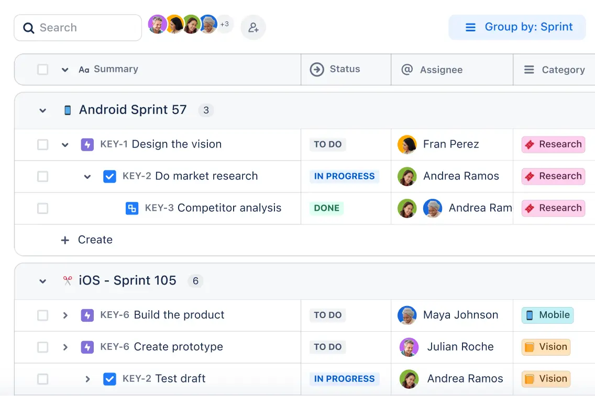
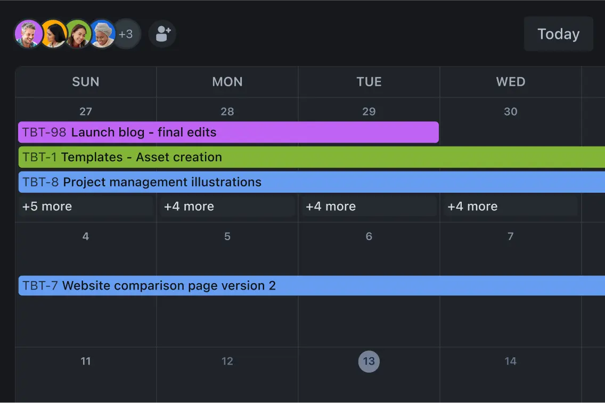
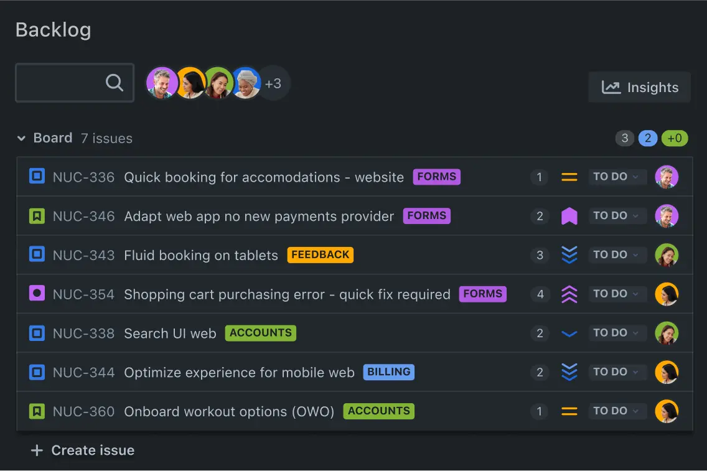
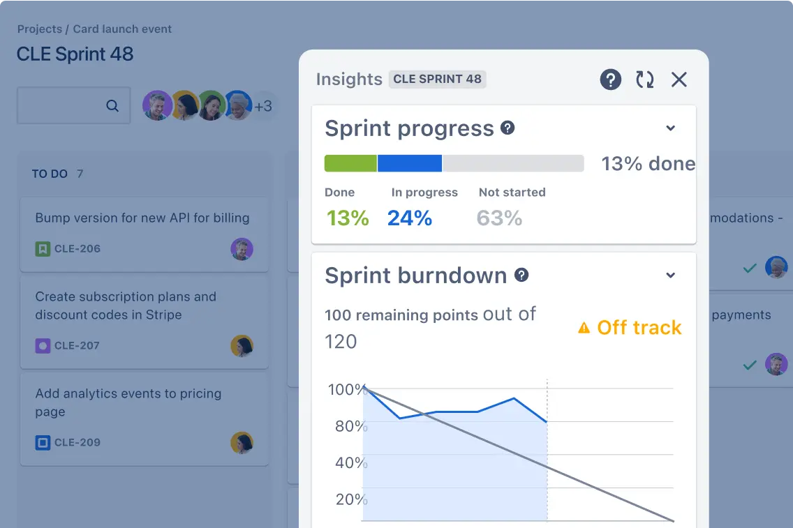
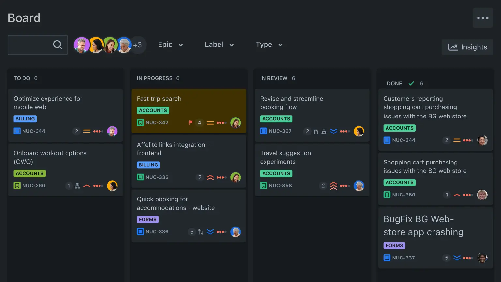
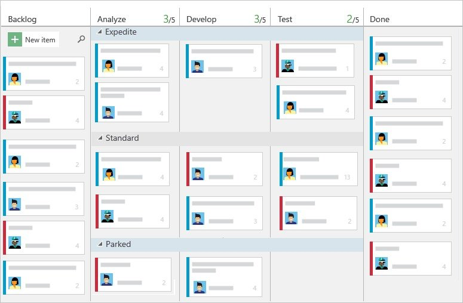
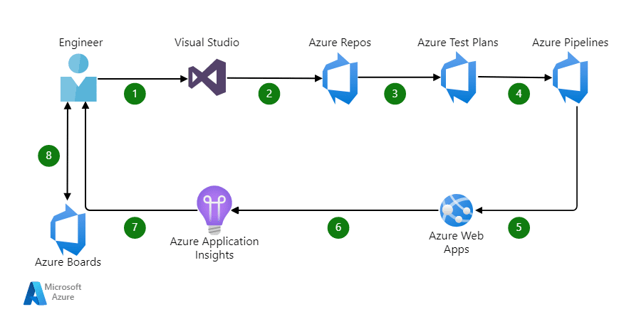
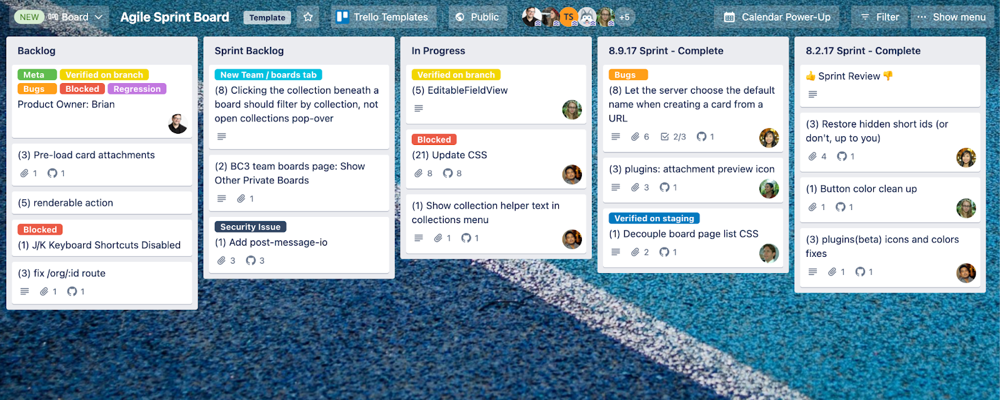
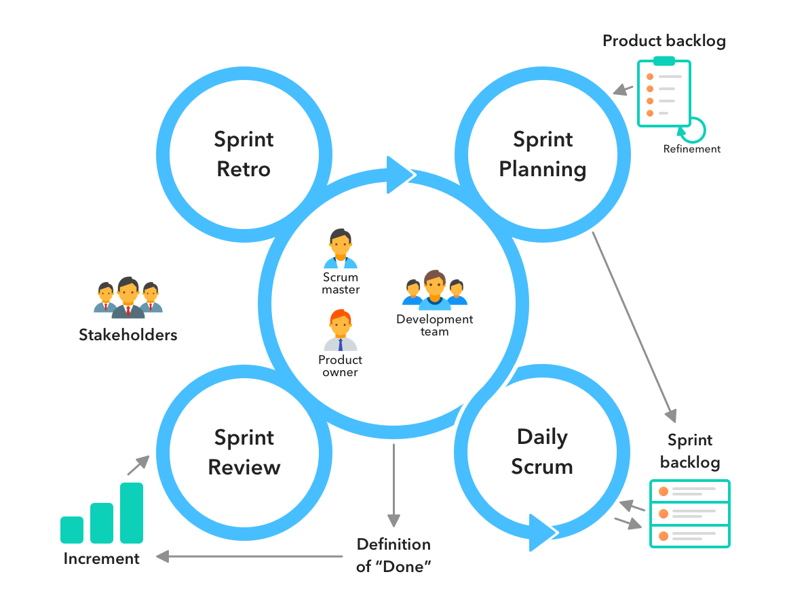
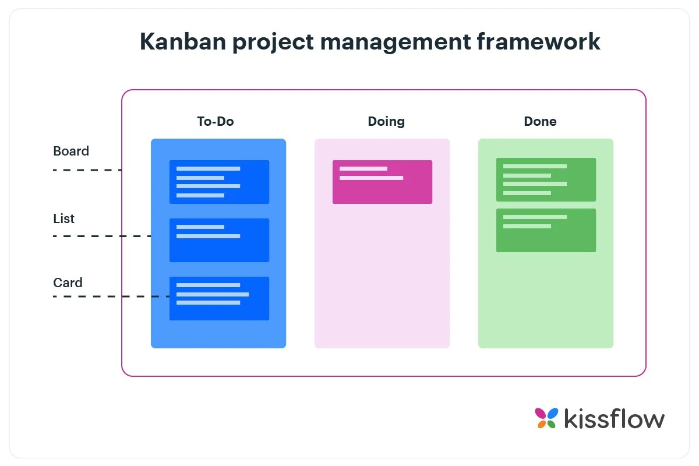

# Tarea 1 <!-- omit from toc -->

    <h3>
        <b>Modelos ágiles y herramientas de gestión de proyectos en la industria del software</b>
    </h3>

 
  
Tabla de contenidos

- [Herramientas de gestión de proyectos de software (tecnología de apoyo)](#herramientas-de-gestión-de-proyectos-de-software-tecnología-de-apoyo)
  - [Jira](#jira)
    - [Funcionalidades](#funcionalidades)
    - [Relación con metodologías ágiles](#relación-con-metodologías-ágiles)
  - [Azure DevOps](#azure-devops)
    - [Funcionalidades](#funcionalidades-1)
    - [Relación con metodologías ágiles](#relación-con-metodologías-ágiles-1)
  - [Trello](#trello)
    - [Funcionalidades](#funcionalidades-2)
    - [Relación con metodologías ágiles](#relación-con-metodologías-ágiles-2)
  - [Comparativa entre los tres](#comparativa-entre-los-tres)
- [Marco teórico profundo de Scrum y Kanban](#marco-teórico-profundo-de-scrum-y-kanban)
  - [Metodología Scrum](#metodología-scrum)
    - [Historia y origen](#historia-y-origen)
    - [Principios fundamentales](#principios-fundamentales)
    - [Estructura del trabajo](#estructura-del-trabajo)
    - [Ventajas y limitaciones](#ventajas-y-limitaciones)
  - [Metodología Kanban](#metodología-kanban)
    - [Historia y origen](#historia-y-origen-1)
    - [Principios fundamentales](#principios-fundamentales-1)
      - [Principios de gestión del cambio en Kanban](#principios-de-gestión-del-cambio-en-kanban)
      - [Principios de entrega de servicios en Kanban](#principios-de-entrega-de-servicios-en-kanban)
    - [Estructura del trabajo](#estructura-del-trabajo-1)
    - [Ventajas y limitaciones](#ventajas-y-limitaciones-1)
  - [Cuándo es más adecuado utilizar Scrum o Kanban](#cuándo-es-más-adecuado-utilizar-scrum-o-kanban)
  - [Aplicación en proyecto estudiantil o real](#aplicación-en-proyecto-estudiantil-o-real)
- [Casos reales de aplicación en la industria](#casos-reales-de-aplicación-en-la-industria)
  - [Netflix](#netflix)
    - [¿Qué marco de trabajo utilizan?](#qué-marco-de-trabajo-utilizan)
    - [¿Qué herramientas tecnológicas usan para gestionarlo?](#qué-herramientas-tecnológicas-usan-para-gestionarlo)
    - [¿Cómo adaptan las metodologías a su cultura organizacional?](#cómo-adaptan-las-metodologías-a-su-cultura-organizacional)
    - [¿Qué beneficios o retos han reportado?](#qué-beneficios-o-retos-han-reportado)
    - [Reflexión crítica: ¿qué se puede aprender de este caso?](#reflexión-crítica-qué-se-puede-aprender-de-este-caso)
  - [Microsoft](#microsoft)
    - [¿Qué marco de trabajo utilizan?](#qué-marco-de-trabajo-utilizan-1)
    - [¿Qué herramientas tecnológicas usan para gestionarlo?](#qué-herramientas-tecnológicas-usan-para-gestionarlo-1)
    - [¿Cómo adaptan las metodologías a su cultura organizacional?](#cómo-adaptan-las-metodologías-a-su-cultura-organizacional-1)
    - [¿Qué beneficios o retos han reportado?](#qué-beneficios-o-retos-han-reportado-1)
    - [Reflexión crítica: ¿qué se puede aprender de este caso?](#reflexión-crítica-qué-se-puede-aprender-de-este-caso-1)

 

---

## Herramientas de gestión de proyectos de software (tecnología de apoyo)

Para esta primera sección de la asignación, se requiere investigar sobre herramientas utilizadas para la planificación, seguimiento y ejecución de proyectos de software. Se seleccionaron **Jira**, **Azure DevOps** y **Trello** para ser analizadas. A continuación se describen cada una de ellas, se explican las funcionalidades que ofrecen y se analiza su integración con metodologías ágiles.

### Jira

Jira corresponde a la primera herramienta de gestión de proyectos de software que se va a analizar.

Fue desarrollada por la compañía Atlassian y es ampliamente utilizada por equipos de trabajo para planear, rastrear, lanzar y dar soporte a software en todo el mundo, puesto que lo emplean a través de todo el *software development life cycle*.

Originalmente fue lanzada en 2002 para rastrear y gestionar errores en el software, pero se ha convertido en una herramienta completa para proyectos que se rigen por metodologías ágiles como Scrum y Kanban, que se analizan en este trabajo.

Además, Atlassian menciona que la herramienta ha sido adoptada por más de 300 mil empresas en sus entornos de trabajo, lo cual evidencia su gran éxito en el mundo empresarial.

Fuente: <a href="https://www.atlassian.com/software/jira/guides/getting-started/introduction#what-is-jira-software">What is Jira? - Atlassian</a>

#### Funcionalidades

Como lo describe la página oficial de Jira, su objetivo consiste en ofrecer planificación de proyectos, seguimiento de errores y tareas, gestión de flujos de trabajo e informes.

En cuanto al flujo de trabajo, esta plataforma se organiza por medio de *issues* o tickets para tareas individuales, que pueden ser asignadas, rastreadas y gestionadas de manera eficiente.
La creación de estos tickets lo suele hacer el *project manager* designado e incluye un estado que indica si la tarea está pendiente, en proceso o completada.
Además, todos los cambios realizados en un ticket quedan documentados.

Fuente: <a href="https://www.ionos.com/es-us/digitalguide/paginas-web/desarrollo-web/que-es-jira/">¿Qué es Jira? Todo lo que necesitas saber sobre el software de gestión de proyectos - IONOS Digital Guide</a>

Luego, Jira permite colaborar activamente con los miembros del equipo, distribuyendo tareas y compartiendo estados intermedios del proyecto.
Cualquier fuente de error puede ser identificada y corregida. 
Además, gracias a su integración con metodologías ágiles como Kanban o Scrum, se pueden planificar *sprints*, almacenar tareas en el *backlog* y seleccionar cuáles serán desarrolladas en cada iteración del proceso de desarrollo.

Según su página oficial, se plantean las siguientes funcionalidades clave:

- **Planear (*Plan*)**: Permite planear los plazos de desarrollo y clasificar tareas según su prioridad.
- **Rastrear (*Track*)**: Rastrea el proceso de desarrollo, con soporte para metodologías ágiles como *Kanban boards*.
- **Colaborar (*Collaborate*)**: Facilita la colaboración entre miembros con múltiples integraciones con aplicaciones de terceros que ofrece (como Slack o GitHub).
- **Lanzar (*Lauch*)**: Conecta los equipos de desarrollo con calendarios de lanzamiento compartidos, por ejemplo.
- **Reportar (*Report*)**: Genera reportes antes, durante y después del *sprint* para analizar el progreso y rendimiento individual y grupal de los miembros.

Además, respecto a utilidades dentro de la interfaz ofrece las siguientes características:

- Vista de lista de las tareas junto con las personas encargadas de cada asignación y su estado (`To Do`,`In progress`, `Done`).

  

- Filtrado de *issues* basado en numerosos requerimientos, desde reportes hasta detalles iniciales de la tarea cuando fue creada.
- Vista de calendario para visualizar los plazos disponibles para ciertas tareas.

  

- Permite guardar las tareas en el *backlog* y seleccionar tareas para ser completadas durante *sprints*.

Fuente e imágenes: <a href="https://www.atlassian.com/software/jira/features">Project management features for all teams - Atlassian</a>

#### Relación con metodologías ágiles

En cuanto a la implementación de metodologías ágiles, como se mencionó brevemente en la sección anterior de funcionalidades, Jira integra una variedad de opciones para trabajar con Scrum y Kanban, por ejemplo.

Al comenzar un proyecto en Jira, los equipos pueden elegir una plantilla entre Scrum o Kanban, que ya viene preconfigurada con tableros y herramientas relevantes, lo cual evidencia desde el inicio la estrecha relación que mantiene la herramienta con metodologías ágiles.

- **Scrum:** Jira proporciona un *product backlog* donde se almacenan las historias de usuario e *issues*. Los equipos pueden estimar *story points* (estimación de esfuerzo para la tarea) y priorizar el trabajo. Pueden planificar el trabajo moviendo un conjunto de historias del *backlog* a un *sprint* con tiempo definido. El tablero Scrum que proporcionan visualiza el progreso del *sprint*, y durante el mismo, el equipo puede actualizar el estado de los *issues* en el tablero. Jira genera automáticamente gráficos de *burndown* para seguir el avance del sprint y calcula la velocidad basada en los puntos de historia completados en cada *sprint*, así como otras métricas relacionadas. Adicionalmente, se pueden asignar roles como *product owner*, *development team* y *Scrum master* dentro del equipo.

  

  

- **Kanban:** Jira proporciona un tablero de Kanban para la visualización de los estados del flujo de trabajo, donde los miembros del equipo van tomando tareas del *backlog* y las mueven a las columnas de `In Progress` y `Done`, para marcar su estado. Además, permite establecer límites de trabajo en progreso (WIP por sus siglas en inglés) por columna y ofrece un diagrama de flujo acumulativo y un gráfico de control para analizar el cycle time de los equipos.

  

Como nota adicional, los equipos pueden personalizar los estados de Scrum y Kanban e incluso implementar híbridos dependiendo del equipo en cuestión.

Fuente: <a href="https://bigpicture.one/blog/using-jira-in-project-management/">Using Jira in project management: use cases & limitations - Jerzy Żurawiecki</a>

Imágenes: <a href="https://www.atlassian.com/software/jira/features">Project management features for all teams - Atlassian</a>

### Azure DevOps

Azure DevOps (ADO) es una plataforma de la compañía Microsoft que ofrece serie de herramientas para desarrollo y gestión de proyectos orientado principalmente a la nube.

Azure DevOps está enfocado para ser utilizado durante todo el ciclo de vida del desarrollo de software (SDLC), pues integra herramientas de planificación, *coding*, construcción y despliegue. 

Originalmente se denominada Visual Studio Team Services (VSTS), pero fue renombrado en 2018 a Azure DevOps, 

Fuente: <a href="https://www.youtube.com/watch?v=JhqpF-5E10I">Introduction to Azure DevOps - Microsoft Visual Studio</a>

#### Funcionalidades

Azure DevOps, como se mencionó, se compone de distintas herramientas que conforman el entorno de desarrollo creado por Microsoft, estas incluyen:

- **Azure Boards:** Manejo de tareas y seguimiento de proyectos.
- **Azure Repos:** Repositorios con control de versiones. Puede ser centralizado con *Team Foundation Version Control* (TFVC) o distribuido con Git.
- **Azure Pipelines:** Para integración continua y despliegue continuo (CI/CD).
- **Azure Test Plans:** Para el testing de la aplicación.
- **Azure Artifacts:** Gestión de artefactos (crear, compartir y *hostear* paquetes con el equipo o cliente).

Fuente: <a href="https://www.ccslearningacademy.com/azure-devops-vs-github/#:~:text=Azure%20DevOps%20is%20a%20suite,Azure%20Artifacts%20for%20artifact%20management">Azure DevOps Vs GitHub - CSS Learning Academy</a>

Por lo tanto, Azure board corresponde al componente específico para la gestión de proyectos y seguimiento del trabajo.
Emplea elementos de trabajo para rastrear requisitos, tareas, errores, historias de usuario, entre otros.
Pueden organizarse en jerarquías, como épicas (objetivo amplio), características (*features*), historias (parte funcional concreta), *bugs* (errores), *test case*, entre otros, y asociarse con estimaciones de esfuerzo.

Además, Azure boards tiene la opción de utilizar una Kanban board y backlogs para organizar las tareas, lo cual evidencia su integración con metodologías ágiles, que se trata a profundidad en la siguiente sección.
Como funcionalidad especial, permite planear un sprint o varios (*Delivery plans*) directamente del backlog.

  

Imagen: <a href="https://devblogs.microsoft.com/devops/azurefunbytes-a-brief-intro-to-azure-boards/">A brief Intro to Azure Board - Microsoft</a>

Adicionalmente, Azure DevOps ofrece tableros personalizables con widgets para mostrar métricas, resultados de consultas, y gráficos como flujo acumulado o *burnout* de un sprint.

Como se mencionó anteriormente, también brinda una fuerte integración con las herramientas de desarrollo como repositorios y pipelines, lo cual permite vincular tareas a commits, pull requests, pruebas y builds. Asimismo, permite CI/CD multiplataforma (Windows, MacOS, Linux y sistemas móviles).
Por lo tanto, se tiene un único entorno donde se tiene la trazabilidad completa de las tareas.
Un flujo de desarrollo de ejemplo se muestra a continuación:

  

Imagen: <a href="https://codefresh.io/learn/azure-devops/">What Is Azure DevOps? Services, Examples, and Best Practices - Codefresh</a>

Azure DevOps también es altamente personalizable dependiendo de los *workflows* que se manejen en cierta compañía y permite utilizar extensiones del Marketplace propio de la comunidad para integrar funcionalidades específicas.

Fuente: <a href="https://www.techtarget.com/searchwindowsserver/definition/Azure-DevOps-formerly-Visual-Studio-Team-Services">Azure DevOps - Stephen J. Bigelow</a>

Fuente: <a href="https://www.youtube.com/watch?v=JhqpF-5E10I">Introduction to Azure DevOps - Microsoft Visual Studio</a>

#### Relación con metodologías ágiles

En cuanto a su relación con metodologías ágiles, se muestran los soportes para Scrum y Kanban a continuación:

- **Scrum:** Al crear un proyecto, se puede elegir la plantilla `Scrum`, que incluye elementos como `Elemento del backlog`, `Tarea` y `Error`. Cada equipo puede definir *sprints*, contar con un backlog de *sprint* y un tablero de tareas para el seguimiento del progreso diario del equipo. Adicionalmente, se permite planificación de capacidad por *sprint* y generación de reportes como gráficos de *burnout*.

Fuente: <a href="https://learn.microsoft.com/es-es/azure/devops/boards/work-items/guidance/agile-process-workflow?view=azure-devops">Flujo de trabajo ágil en Azure Boards - Microsoft</a>

- **Kanban:** Para el flujo continuo se pueden utilizar los tableros Kanban integrados. Se pueden configurar tableros personalizados con límites WIP (*work in progress*), diagramas de flujo acumulado, y listas de *backlog* para priorización de tareas. 

Fuente: <a href="https://unito.io/blog/azure-devops-kanban-guide/">A guide to Kanban methodology in Azure DevOps - Unito</a>

Adicionalmente, los *Delivery Plans* permiten coordinar *sprints* entre equipos, y las jerarquías de trabajo (épicas, características, historias, entre otros) ayudan a organizar trabajo a gran escala.

En general, Azure DevOps permite mezclar prácticas dependiendo del equipo de trabajo.

### Trello

Trello es una herramienta ligera de gestión de proyectos basada en tableros al estilo Kanban. Actualmente forma parte de la compañía Atlassian, al igual que Jira analizado anteriormente.

La metodología de organización en Trello consiste en un sistema simple y flexible de tableros, listas y tarjetas que puede adaptarse para gestionar prácticamente cualquier tipo de proyecto.
La idea es diseñar distintas columnas (listas) que representan estados de las tareas (tarjetas) y se mueven conforme se van completando. 

En comparación con las otras dos herramientas, esta corresponde a la más simple y fácil de utilizar de primera entrada.

#### Funcionalidades

Inicialmente, es importante mencionar que Trello no incluye funciones especializadas para desarrollo de software de forma predeterminada, pero su flexibilidad permite que los equipos lo adapten a sus necesidades.

Los tableros, listas y tarjetas corresponden a los componentes básicos de Trello. Un tablero representa un proyecto o un espacio.
Cada tablero contiene listas (columnas), que generalmente representan etapas de un flujo de trabajo o categorías.
Dentro de las listas, los usuarios crean tarjetas, que representan tareas individuales.
Las tarjetas se pueden mover entre listas, lo cual refleja el progreso de una tarea.

La planificación en Trello implica la creación de tarjetas en una lista de tareas pendientes, y luego moverlas a través de las etapas de ejecución.

A pesar de su simplicidad, cada tarjeta puede contener una gran cantidad información.
Al hacer clic en una tarjeta, se puede ver su descripción, agregar listas de verificación (subtareas dentro de la tarjeta), fechas límite, etiquetas, asignaciones, comentarios y archivos adjuntos.
Todas las personas dentro del equipo pueden ver esta información.

Trello permite colaboración en tiempo real en los tableros del equipo.
Los miembros pueden asignarse a tarjetas y reciben notificaciones por cambios en esas tarjetas.

Las funcionalidades de Trello se pueden ampliar mediante *Power-Ups*, que son integraciones adicionales.
Algunos populares incluyen: vista de calendario, votación, e integraciones con Google Drive, Slack, GitHub, entre otros.

Es particularmente interesante la integración con GitHub, puesto que permite rastrear commits, pull requests e *issues* directamente desde Trello.

Fuente: <a href="https://www.simplilearn.com/tutorials/project-management-tutorial/what-is-trello">What is Trello and How To Use It? - Simplilearn</a>

Fuente: <a href="https://www.linkedin.com/advice/0/what-best-ways-use-trello-software-development-prege">What are the best ways to use Trello for software development tasks? - LinkedIn</a>

#### Relación con metodologías ágiles

Trello al ser una herramienta sencilla y personalizable, permite utilizar templates que se ajustan a los modelos de metodologías ágiles como Scrum y Kanban.
Existen plantillas comunes predeterminadas para estas actividades.

Por ejemplo como publicó la página oficial de Trello, se tienen los siguientes usos relacionados a metodologías ágiles dentro de un equipo:

- **Construcción y ejecución de flujos ágiles:** Trello permite implementar flujos de trabajo ágiles mediante tableros específicos para *sprints*. Con la plantilla *Agile Sprint Board*, el equipo puede visualizar claramente el *backlog* general, *backlog* del *sprint*, trabajo en curso y tareas completadas. Las tarjetas se mueven de columna en columna conforme se avanza en cada *sprint*. Además, ofrece una plantilla Kanban con columnas para cada etapa del proceso del SDLC: Backlog, Diseño, Por hacer, En curso, Revisión de código, Pruebas y Hecho.

- **Monitoreo y gestión de reportes de errores (bugs):** También facilita el manejo ágil de errores con la plantilla *Bug Tracker*, que permite clasificar bugs en columnas como Reportado, No Reproducible, Planificado, En progreso, Confirmar Arreglo, Hecho, o No se Arreglará.

- **Integración (Power-Up) con GitHub:** Vincular commits, pull requests e issues directamente a tarjetas.

  

Imagen: <a href="https://www.atlassian.com/blog/trello/trello-for-software-development">6 ways to use Trello for software development at your enterprise - Atlassian</a>

En relación con Scrum, Trello no soporta un manejo de *sprints* de forma predeterminada, pero nuevamente por medio de *Power-Ups* y *templates*, se puede conseguir un resultado similar. Por otro lado, para Kanban, es una herramienta ideal para equipos pequeños especialmente.

En resumen, Trello es una herramienta altamente adaptable a metodologías ágiles como Scrum y Kanban, especialmente por su estructura basada en tableros, listas y tarjetas permite planificar, ejecutar y mejorar iteraciones del SDLC. Depende de la compañía o equipo qué tanto quiere implementar al flujo de trabajo.

Fuente: <a href="https://www.atlassian.com/blog/trello/trello-for-software-development">6 ways to use Trello for software development at your enterprise - Atlassian</a>

Además en [esta fuente](https://polcode.com/resources/blog/trello-in-software-development-how-to-manage-complex-projects/) se muestra un ejemplo de un *workflow* con Trello con metodologías ágiles de forma alternativa. Realizan la comunicación y envío de recursos por medio de esta plataforma, guardan las tareas pendientes en el *backlog* designado, y crearon distintas columnas para cada etapa del SDLC.

### Comparativa entre los tres

En la tabla a continuación, se muestra un comparativa entre cada una de las herramientas analizadas en esta sección, basado en diferentes criterios.

| Criterio                          | Jira                                                                 | Azure DevOps                                                            | Trello                                                                 |
|----------------------------------|----------------------------------------------------------------------|---------------------------------------------------------------------------|------------------------------------------------------------------------|
| **Facilidad de uso**             | Curva de aprendizaje alta; potente pero complejo al inicio          | Moderadamente fácil al inicio; complejidad aumenta con funcionalidades  | Muy fácil de usar e intuitivo                              |
| **Integración con plataformas**  | Muchas integraciones con otros servicios; ideal para entornos DevOps | Integración con herramientas Microsoft y buenas opciones externas | *Power-Ups* limitados pero útiles; buena integración con herramientas generales |
| **Popularidad y adopción**       | +300,000 empresas; estándar en equipos de desarrollo ágiles   | Uso amplio en empresas grandes; muy común en entornos Microsoft         | +50 millones de usuarios; popular entre equipos pequeños |
| **Tamaño de equipo** | Ideal desde medianas hasta grandes organizaciones                  | Óptimo para medianas y grandes empresas, especialmente entornos Microsoft | Perfecto para individuos y equipos pequeños; funcional para medianos con *Power-Ups*   |
| **Soporte para Scrum**           | Excelente: *sprints*, *backlogs*, informes, escalado ágil               | Soporte completo con *sprints*, *boards* y reportes                  | Limitado; requiere *Power-Ups* o plantillas                             |
| **Soporte para Kanban**          | Totalmente configurable con WIP                                     | Tableros avanzados y altamente personalizables                            | Diseño de Kanban natural                          |
| **Automatización**               | Reglas avanzadas de automatización                                  | Flujo CI/CD automatizado; planificación y seguimiento automatizado     | Existe Butler (automatización básica de tareas)                              |
| **Comunidad y recursos**         | Gran comunidad, extensa documentación y soporte                     | Soporte técnico robusto, documentación empresarial                      | Amplia base de usuarios; documentación sencilla                       |

En primer lugar, Jira destaca por su alta capacidad de personalización, sus potentes funciones ágiles (Scrum y Kanban) y su ecosistema escalable. Es ideal para equipos medianos a grandes que requieren trazabilidad completa, flujos de trabajo avanzados y métricas detalladas (como reportes y gráficos *burnout*). Se recomienda cuando se necesita gestionar múltiples equipos.

En segundo lugar, Azure DevOps ofrece un entorno integral de desarrollo que abarca desde la planificación hasta la entrega continua (CI/CD), lo cual lo convierte en la mejor opción para equipos que ya trabajan con tecnologías Microsoft o que buscan una integración fluida entre código, pruebas y despliegue. Su valor diferencial radica en combinar la gestión de proyectos con herramientas de desarrollo en una sola plataforma.

Finalmente, Trello aporta un enfoque simple, visual e intuitivo, lo cual lo hace ideal para equipos pequeños y proyectos personales. Su curva de aprendizaje casi nula lo hace recomendable para comenzar a organizar tareas rápidamente. Aunque está limitado en funciones avanzadas en comparación los otros dos, su facilidad de adopción lo convierten en una herramienta efectiva en contextos específicos.

---

## Marco teórico profundo de Scrum y Kanban

### Metodología Scrum

Primeramente, se va a analizar la metodología Scrum en el contexto de desarrollo de software.

#### Historia y origen

En esta sección se muestra una línea temporal de la historia de Scrum.

- **1986 – Origen del concepto:** Takeuchi y Nonaka introdujeron la idea en su artículo "The New New Product Development Game", donde compararon el desarrollo de productos con el rugby. Propusieron un enfoque colaborativo, escalable y basado en equipos autoorganizados, aplicado exitosamente por empresas como Honda y Canon.

- **1993 – Primer equipo Scrum:** Jeff Sutherland, John Scumniotales y Jeff McKenna implementaron por primera vez el enfoque Scrum en la empresa Easel Corporation, basándose en el artículo de Takeuchi y Nonaka.

- **1995 – Presentación pública:** Ken Schwaber presentó formalmente Scrum en la conferencia OOPSLA. Paralelamente, Kent Beck comenzó a desarrollar Extreme Programming (XP) en colaboración con Schwaber y Sutherland, asegurando compatibilidad entre ambos enfoques.

- **2001 – Nace el Manifiesto Ágil:** Diecisiete expertos firmaron el Manifiesto Ágil como alternativa a los métodos tradicionales de desarrollo. Establece 4 valores y 12 principios que siguen guiando al desarrollo ágil.

- **2002 – Fundación de Scrum Alliance:** Creada por Mike Cohn, Esther Derby y Ken Schwaber, esta organización promueve la educación y certificación en Scrum, incluyendo el popular Certified Scrum Master (CSM).

- **2006 – Fundación de Scrum Inc.:** Jeff Sutherland fundó Scrum Inc. para ofrecer servicios de capacitación y consultoría sobre Scrum.

- **2009 – Nace Scrum.org:** Ken Schwaber se separó de Scrum Alliance y fundó Scrum.org, con un enfoque propio para la formación en Scrum.

- **2010 – Publicación de la Scrum Guide:** Schwaber y Sutherland publicaron la primera Scrum Guide, una guía clara y minimalista del marco de trabajo Scrum. Ha sido actualizada en 2011, 2013, 2016, 2017 y 2020.

Fuente: <a href="https://www.agile42.com/en/blog/scrum-history">The History of Scrum - Agile42</a>

#### Principios fundamentales

Scrum se basa en la empiricidad, es decir, en tomar decisiones a partir de la observación, la experiencia y la experimentación. Este enfoque está sostenido por tres pilares:

- **Transparencia:** Todos deben tener visibilidad del proceso y el trabajo.
- **Inspección:** Se revisa el progreso con frecuencia.
- **Adaptación:** Se ajusta el rumbo en función de lo aprendido.

Para que Scrum funcione, el equipo debe construir una base de confianza y vivir según los cinco valores de Scrum:

- Coraje
- Enfoque
- Compromiso
- Respeto
- Apertura

Estos valores fortalecen la colaboración y permiten que el equipo se desenvuelva bien en entornos donde la experimentación y la mejora continua son fundamentales para la metodología en cuestión.

Fuente: <a href="https://www.scrum.org/resources/what-scrum-module">What is Scrum? - Scrum.org</a>

  

Imagen: <a href="https://startinfinity.com/project-management-methodologies/scrum">Scrum Methodology: An Agile Framework for Project Management - Infinity</a>

#### Estructura del trabajo

En Scrum existen tres roles principales:

- **Scrum Master:** Facilita el proceso Scrum y realiza reuniones diarias con el *Scrum team*, guía al equipo, elimina obstáculos, aplica las reglas del marco y asegura condiciones óptimas para el trabajo.
- **Product Owner:** Representa a los interesados (como clientes), gestiona el backlog del producto, define prioridades y garantiza que cada sprint genere valor. Generalmente se encarga de determinar las expectativas del producto.
- **Scrum Team:** Grupo autoorganizado de 3 a 9 personas con habilidades diversas. Se encargan de ejecutar las tareas, resolver problemas y entregar resultados en cada sprint.

Además, hay roles auxiliares como gerentes, clientes o ejecutivos, que aunque no forman parte directa del *Scrum team*, colaboran brindando retroalimentación y seguimiento.

Fuente: <a href="https://innevo.com/blog/metodologia-scrum#:~:text=En%20resumen%2C%20el%20proceso%20de,para%20mejorar%20continuamente%20el%20proceso.">Metodología Scrum: Roles, Procesos y Artefactos - Innevo</a>

Además, en Scrum, los artefactos principales son:

- **Backlog del producto:** Lista dinámica de funciones, mejoras y tareas necesarias para desarrollar el producto. Es mantenido por el *Product Owner* y se actualiza constantemente según nuevas prioridades o información.
- **Backlog de sprint:** Conjunto de tareas seleccionadas del *backlog* del producto que se desarrollarán en el *sprint* actual. Estas tareas se descomponen en subtareas más pequeñas y se asignan a los equipos según su capacidad.
- **Incremento del producto:** Es el resultado del trabajo realizado durante un sprint, incluyendo avances de sprints anteriores. Representa una versión funcional del producto que puede entregarse al cliente. Se integra con herramientas de CI/CD para facilitar el seguimiento, publicación y control del código.

Fuente: <a href="https://www.atlassian.com/es/agile/scrum/artifacts">Artefactos del scrum ágil - Atlassian</a>

Finalmente, se tienen las ceremonias dadas en esta metodología.
En la tabla a continuación se resumen los principales tipos en la metodología Scrum:

| **Ceremonia**                | **Cuándo se realiza**     | **Asistentes**                                     | **Duración estimada**                         | **Propósito**                                                                 |
|-----------------------------|---------------------------|---------------------------------------------------|-----------------------------------------------|--------------------------------------------------------------------------------|
| **Planificación del Sprint**| Al inicio de cada sprint  | Scrum Master, Product Owner, Equipo de Desarrollo | 1 hora por semana de sprint       | Definir qué se hará en el sprint y cómo se logrará. Se genera el backlog del sprint. |
| **Scrum Diario (Daily Scrum)**| Cada día del sprint       | Todo el equipo Scrum                              | Máximo 15 minutos generalmente                             | Compartir avances, plan de trabajo del día y obstáculos. Mantiene alineado al equipo. |
| **Revisión del Sprint**     | Al finalizar el sprint    | Equipo Scrum y partes interesadas                 | 45 minutos por semana de sprint   | Mostrar el trabajo completado y recibir retroalimentación.                         |
| **Retrospectiva del Sprint**| Después de la revisión    | Scrum Master, Product Owner, Equipo de Desarrollo | 45 minutos por semana de sprint   | Reflexionar sobre lo que funcionó y lo que se puede mejorar. Plan de mejora continua.  |

Fuente: <a href="https://www.atlassian.com/es/agile/scrum/ceremonies">Guía de metodología ágil para las reuniones de scrum - Atlassian</a>

#### Ventajas y limitaciones

Scrum es ampliamente adoptado por sus beneficios clave en la gestión de proyectos ágiles:

- Permite completar entregables de manera rápida y eficiente.
- Asegura un uso óptimo del tiempo y del presupuesto.
- Divide grandes proyectos en sprints pequeños y manejables.
- El código y las pruebas se realizan dentro del mismo *sprint*.
- Es ideal para proyectos con desarrollos que avanzan rápidamente.
- Las reuniones frecuentes (*daily scrums*) brindan visibilidad clara del progreso.
- Se adapta fácilmente a los cambios gracias al feedback de clientes y partes interesadas.
- Las iteraciones cortas facilitan incorporar mejoras continuamente.

Sin embargo, como cualquier marco de trabajo, Scrum también presenta ciertas limitaciones:

- Puede generar *scope creep* (desviación del alcance) al no tener una fecha de finalización fija.
- Requiere alto compromiso y colaboración; sin ello, el proyecto puede fracasar.
- Es difícil de aplicar en equipos grandes, pues requiere mucha organización.
- Funciona mejor con miembros experimentados; los equipos novatos pueden tener problemas.
- Las reuniones diarias pueden resultar molestas para algunos miembros.
- La salida de un miembro clave durante el proyecto puede tener un impacto serio.
- La calidad del producto depende de una fase de pruebas rigurosa.

Fuente: <a href="https://www.simplilearn.com/scrum-project-management-article">Scrum Project Management: Advantages and Disadvantages - Simplilearn</a>

### Metodología Kanban

Ahora, se va a tratar la metodología Kanban enfocada en el desarrollo software.

#### Historia y origen

Kanban nació en Japón a finales de la década de 1940, desarrollado por Taiichi Ohno en Toyota como parte del Sistema de Producción Toyota, también conocido como producción *just-in-time* (JIT).

La palabra kanban significa *cartel* en japonés y se utilizaba en las fábricas para señalar la necesidad de insumos desde otro departamento, lo cual ayudaba a reducir desperdicios y mejorar la eficiencia.

En 1963, Toyota ya había implementado el sistema Kanban en la mayoría de sus procesos. En 1973, Ohno publicó el libro Toyota Production System, que sentó las bases del enfoque Lean: reducir desperdicios, maximizar valor al cliente y buscar mejora continua.

Con el tiempo, Kanban se adaptó a la industria del software, pues se integró bien con metodologías ágiles y DevOps.
Su enfoque visual del trabajo ayuda a gestionar tareas dinámicamente, acelerar entregas y aumentar la satisfacción del cliente.

Entre los hitos importantes de esta metodología destaca:

- **2001:** Se publica el Manifiesto Ágil (*Agile Manifesto*), con valores y principios fundamentales del desarrollo ágil.
- **2004:** David Anderson aplica Kanban en Microsoft y publica *Agile Management for Software Engineering*, llevando Kanban del entorno industrial al trabajo del conocimiento a nivel global.

Fuente: <a href="https://www.projectmanager.com/blog/kanban-history">Kanban History: Origin & Expansion Across Industries - Brenna Schwartz</a>

#### Principios fundamentales

Los principios fundamentales que sigue este tipo de metodología, se dividen en dos:

- Principios de gestión del cambio en Kanban
- Principios de entrega de servicios en Kanban

##### Principios de gestión del cambio en Kanban

Esta subdivisión de los principios de Kanban consiste en los siguientes 3:

- **Empezar con lo que hace ahora:** Kanban se integra con los procesos existentes sin interrumpirlos. Permanecen los roles y estructuras actuales, y promueve mejoras progresivas sin cambios drásticos.
- **Buscar el cambio incremental y evolutivo:** Se favorecen los ajustes pequeños y constantes. Los grandes cambios suelen generar resistencia, mientras que las mejoras graduales permiten adaptación y aceptación.
- **Promover el liderazgo en todos los niveles:** La mejora continua debe venir de todos los miembros del equipo. Cualquier observación puede contribuir al progreso del sistema.

##### Principios de entrega de servicios en Kanban

Respecto a la entrega de servicios, se tienen los 3 principios a continuación:

- **Enfocarse en las necesidades del cliente:** La prioridad es entregar valor real al cliente. Comprender sus expectativas ayuda a mejorar la calidad del servicio y a centrar el trabajo en lo importante.
- **Gestionar el trabajo, no a las personas:** El enfoque está en organizar el trabajo de forma que las personas se autogestionen.
- **Revisar regularmente la red de servicios:** Se debe evaluar de forma constante cómo se están prestando los servicios y si las políticas de trabajo siguen siendo efectivas.

Fuente: <a href="https://businessmap.io/kanban-resources/getting-started/kanban-principles-practices">Kanban Principles and Practices Explained - BusinessMap</a>

#### Estructura del trabajo

Kanban es un marco visual para gestionar tareas que mejora la eficiencia y la transparencia en equipos de desarrollo ágil y DevOps. Su base está en representar visualmente el flujo de trabajo y limitar el trabajo que se está realizando en un momento dado.

- **Columnas (flujo de trabajo visual):** El tablero Kanban se divide en columnas que representan las etapas del proceso de desarrollo. Suelen existir `Por hacer`, `En progreso`, `Hecho`, por mencionar algunas. Sin embargo, estas columnas pueden adaptarse a los procesos específicos del equipo, lo cual permite visualizar en qué fase está cada tarea y detectar cuellos de botella rápidamente.

- **Tarjetas Kanban:** Cada tarea se representa como una tarjeta, que contiene información como la descripción, la persona asignada y el tiempo estimado. Las tarjetas se mueven de una columna a otra conforme avanzan en el flujo de trabajo.

- **Flujo de trabajo:** El flujo en Kanban se basa en un avance progresivo y continuo de las tareas. La visualización clara del estado de cada elemento y la identificación de dependencias ayudan a resolver problemas rápidamente y mantener el ritmo de trabajo constante.

- **WIP (Work In Progress):** Kanban establece límites al trabajo en curso (*work in progress*) por columna para evitar la sobrecarga del equipo, reducir la multitarea y mantener la eficiencia.

A diferencia de la metodología Scrum, en Kanban no existen roles específicos para los miembros del equipo relacionados con la organización de la metodología.

  

Imagen: <a href="https://kissflow.com/project/agile/kanban-methodology/">Kanban Methodology: The Simplest Agile Framework - Kissflow</a>

#### Ventajas y limitaciones

Las principales ventajas relacionadas con el uso de la metodología Kanban, se muestra listadas a continuación:

- **Visualización del trabajo:** Los tableros Kanban permiten representar visualmente cada tarea, facilitando el seguimiento del flujo de trabajo, la detección de cuellos de botella y el alineamiento del equipo.
- **Flexibilidad y adaptabilidad:** Kanban no depende de iteraciones fijas. Permite responder rápidamente a cambios de prioridades o interrupciones, adaptándose al ritmo del equipo y a la situación del proyecto.
- **Mejora continua:** Al analizar el flujo de trabajo de forma constante, el equipo puede implementar mejoras graduales, y optimizar procesos.
- **Reducción del trabajo (WIP):** Limitar el número de tareas simultáneas mejora el enfoque, acorta los tiempos de entrega y evita la multitarea que no es muy productiva.
- **Mayor satisfacción del cliente:** La capacidad de priorizar tareas importantes y adaptarse a feedback en tiempo real permite entregar valor más rápidamente, mejorando la experiencia del cliente.

En cuanto a algunas limitaciones de esta metodología, se tienen las siguientes:

- **Falta de estructura prescriptiva:** A diferencia de Scrum, Kanban no define roles, ceremonias ni iteraciones. Esta flexibilidad, si no se gestiona bien, puede generar confusión o inconsistencia entre equipos y objetivos.
- **Ausencia de lapsos de tiempo definidos:** Kanban no organiza el trabajo en períodos fijos de tiempo (como los *sprints* en Scrum), lo que dificulta imponer fechas límite o hacer seguimientos.
- **Planificación y estimación limitadas:** Dado que el enfoque está en el flujo continuo, puede resultar complicado estimar fechas de entrega o planificar a largo plazo.
- **Riesgo de exceso de trabajo en curso (WIP):** Si no se establecen y controlan límites adecuados, los equipos pueden verse saturados con muchas tareas simultáneas, lo que reduce la productividad.
- **Dependencia de la autodisciplina:** Para que Kanban funcione bien, el equipo debe ser disciplinado en la actualización del tablero y en el cumplimiento de buenas prácticas, lo cual puede ser difícil sin supervisión.
- **Colaboración de equipo menos estructurada:** Aunque Kanban promueve la transparencia individual, no enfatiza tanto la colaboración estructurada como Scrum.
- **Limitaciones de complejidad:** Si las Kanban boards se vuelven muy complejas y complicadas de entender fácilmente, especialmente en proyectos grandes, en lugar de ayudar, pueden afectar la productividad del equipo, debido a que se vuelven abrumadoras de mantener.

Fuente: <a href="https://www.agilefever.com/blog/Kanban-Methodology-Advantages-and-Disadvantages-in-Project-Management/">Kanban Methodology: Advantages and Disadvantages in Project Management - AgileFever</a>

Fuente: <a href="https://www.workamajig.com/blog/kanban-methodology-guide/pros-cons-kanban-method">Pros & Cons Of The Kanban Method In Project Management - Workamajig</a>

Fuente: <a href="https://www.linkedin.com/pulse/pros-cons-using-kanban-boards-scrum-master-evert-klopper">Pros and Cons of Using Kanban Boards as a Scrum Master - Evert Klopper</a>

### Cuándo es más adecuado utilizar Scrum o Kanban

En la tabla a continuación, se resumen las características de las metodologías Scrum y Kanban, basado en distintos criterios.

| **Aspecto**                             | **Scrum**                                                                                             | **Kanban**                                                                                               |
|----------------------------------------|--------------------------------------------------------------------------------------------------------|-----------------------------------------------------------------------------------------------------------|
| **Tipo de proceso**                    | Iterativo e incremental (timeboxed).                                                                  | Flujo continuo (no iterativo).                                                                           |
| **Estructura temporal**                | Sprints fijos (1 a 4 semanas).                                                                         | Flujo continuo sin cadencias obligatorias.                                                               |
| **Roles definidos**                    | Sí: Product Owner, Scrum Master, Equipo de Desarrollo.                                                 | No definidos formalmente; roles existentes se mantienen.                                                 |
| **Artefactos principales**            | Product Backlog, Sprint Backlog, Incremento.                                                           | Tablero Kanban, tarjetas, políticas explícitas.                                                          |
| **Ceremonias / eventos**              | Sprint Planning, Daily Scrum, Sprint Review, Sprint Retrospective.                                     | No obligatorias, pero se recomiendan reuniones de revisión, sincronización y mejora.                    |
| **Gestión del trabajo**               | Basada en lotes de trabajo seleccionados para cada Sprint.                                             | Basada en la visualización del flujo y límites de trabajo en curso (WIP).                                |
| **Límites de WIP**                    | No aplican explícitamente.                                                                             | Elemento central: se establecen límites por columna o por equipo.                                        |
| **Adaptación al cambio**              | Cambios dentro del Sprint no son recomendables.                                                        | Cambios de prioridad pueden hacerse en cualquier momento.                                                 |
| **Entrega de valor**                  | Al final de cada Sprint (incremento potencialmente entregable).                                        | Continua, tan pronto como una tarea está terminada.                                                       |
| **Facilidad de adopción**            | Requiere cambios estructurales y culturales más profundos.                                              | Fácil de implementar sobre procesos existentes; baja resistencia inicial.                                 |
| **Flexibilidad**                      | Moderada; más estructurado y prescriptivo.                                                             | Alta; adaptable, con mejora continua.                                                                    |

Basado en las condiciones anteriores, se recomiendan las siguientes condiciones de uso. Para el caso de Scrum, se utiliza cuando:

- El proyecto es nuevo, complejo y tiene alta incertidumbre.

- Se requieren entregas periódicas y planificadas lo que logra versiones del producto funcionales de forma regular.

- Se necesita claridad en la planificación y foco en el valor entregado. El backlog priorizado y las revisiones de sprint permiten asegurar que se trabaja en lo más valioso.

- Hay disponibilidad para asumir el overhead de ceremonias.

- El cambio no es tan urgente ni constante en medio de los *sprints*.

Ahora bien, para el caso de Kanban, es recomendable utilizarlo cuando se presentan las condiciones a continuación:

- Se trabaja en mantenimiento, soporte, DevOps o tareas con llegada impredecible. Kanban se adapta bien a flujos continuos de trabajo y no necesita planificación fija.
- Se busca optimizar el flujo y adaptarse rápidamente.
- Se requiere visibilidad constante del estado del trabajo.
- No hay necesidad de ciclos o entregas regulares, sino respuesta continua.

### Aplicación en proyecto estudiantil o real

En proyectos estudiantiles de desarrollo de software con alcance definido y una fecha de entrega clara (por ejemplo, al final del semestre), Scrum resulta una metodología adecuada. Permite dividir el trabajo en Sprints de 2 a 3 semanas, generando incrementos funcionales periódicos que facilitan el feedback continuo del profesor o usuarios de prueba.

La distribución de roles (Scrum Master, Product Owner, Equipo de Desarrollo) favorece el desarrollo de habilidades como liderazgo, comunicación y autoorganización.
Las ceremonias de Scrum fomentan la disciplina y la mejora continua.
Además, ayuda a evitar la postergación del trabajo al comprometer al equipo con entregas constantes, lo cual favorece la detección de problemas.

Por otro lado, para proyectos con tareas impredecibles como soporte, mantenimiento o investigación sin requerimientos cerrados, Kanban puede ser una mejor opción.
Permite gestionar un flujo continuo de trabajo mediante tableros visuales y priorización dinámica, siendo más adecuado para entornos donde las tareas llegan de forma no planificada.

En el ámbito profesional, Scrum se recomienda para proyectos con entregas iterativas y clientes que requieren avances frecuentes.
En cambio, Kanban se ajusta mejor a equipos DevOps, donde es necesario responder con agilidad a incidentes y medir el rendimiento.

En muchas compañías, ambos marcos coexisten según el tipo de equipo y su función, lo que demuestra que la elección metodológica debe ajustarse al contexto del trabajo.

---

## Casos reales de aplicación en la industria

### Netflix

#### ¿Qué marco de trabajo utilizan?

Netflix no adopta un marco ágil único de forma homogénea en toda la empresa. De hecho, su cultura no fomenta procesos formales rígidos​.
En la práctica, esto significa que no existe una implementación corporativa de Scrum, Kanban u otra metodología que todos deban seguir.

Por lo tanto, la agilidad en Netflix surge de sus principios culturales, con diferentes equipos aplicando las prácticas ágiles que mejor les funcionan.

El desarrollo de software en Netflix tiende a alinearse con principios Lean/DevOps: los equipos son muy pequeños y trabajan con ciclos de entrega continua.

Fuente: <a href="https://www.smharter.com/blog/how-large-successful-companies-achieve-agility-at-scale-2/#:~:text=From%20the%20engineering%20point%20of,of%20one%20large%20engineering%20team">How large successful companies achieve agility at scale – Part 2 - SMHARTER</a>

#### ¿Qué herramientas tecnológicas usan para gestionarlo?

Entre las herramientas comúnmente usadas por los empleados de Netflix, se destacan:

- **Jira y Trello:** Los equipos de Netflix usan herramientas agile-friendly como Jira y Trello para gestionar tareas, historias de usuario y seguimiento del progreso​. Estas herramientas les permiten configurar tableros visuales (Kanban boards) y hacer planeación de sprints cuando es pertinente.
- **Confluence:** Centraliza la documentación y promueve la transparencia y el intercambio de conocimientos.
- **Slack:** Aplicación de mensajería que fomenta una comunicación ágil con actualizaciones en tiempo real y resolución rápida de problemas.
- **Keystone (herramienta propia):** Analiza datos de uso para asegurar que los proyectos sean relevantes para los usuarios.
- **Spinnaker (herramienta propia):** Automatiza el despliegue de actualizaciones en las plataformas de streaming.

Fuente: <a href="https://www.sprintzeal.com/blog/netflix-project-management">Netflix's Binge-Worthy Project Management - SprintZeal</a>

#### ¿Cómo adaptan las metodologías a su cultura organizacional?

Netflix creó una cultura donde las ideas centrales de Agile (equipos pequeños, comunicación abierta, adaptabilidad al cambio, entrega continua) prosperan sin necesidad de imponer una metodología formal.

La adaptación de la agilidad en Netflix es más cultural que procedimental.
La empresa básicamente recluta trabajadores excelentes (Principio *keepers test*), les da metas claras, los rodea de datos y herramientas potentes, y luego confía en ellos para iterar rápidamente hacia los objetivos establecidos.

Muchas de las prácticas ágiles (reuniones diarias, tableros, sprints) pueden o no estar presentes de equipo a equipo, pero los principios (entrega temprana y constante, mejora continua, colaboración, respuesta al cambio) sí lo están.

#### ¿Qué beneficios o retos han reportado?

La agilidad cultural de Netflix le permitió cambiar su modelo de negocio exitosamente.
Cada uno de estos giros requirió una enorme capacidad de adaptación interna, y Netflix pudo ejecutarlos antes que sus competidores gracias a organizaciones ágiles internas.

En su operación diaria, Netflix se mueve a gran velocidad. La mayoría de los equipos realizan despliegues en producción con gran frecuencia, manteniendo un flujo de nuevas funcionalidades y arreglo de *bugs* constante​.

Fuente: <a href="https://www.smharter.com/blog/how-large-successful-companies-achieve-agility-at-scale-2/#:~:text=From%20the%20engineering%20point%20of,of%20one%20large%20engineering%20team">How large successful companies achieve agility at scale – Part 2 - SMHARTER</a>

Un beneficio diferenciador de Netflix es cómo integra la retroalimentación de los usuarios de manera ágil para guiar la producción de contenido y las funcionalidades.
A través del análisis cuantitativo de enormes volúmenes de datos de visualización y también de pruebas cualitativas, Netflix ajusta rápidamente su oferta.

Fuente: <a href="https://www.linkedin.com/pulse/agile-content-production-netflix-case-study-david-mccreery-h0koe#:~:text=One%20notable%20example%20is%20Netflix’s,which%20emphasises%20flexibility%20and%20responsiveness">Agile Content Production at Netflix: A Case Study - David McCreery</a>

Además, a causa de los valores descritos anteriormente, se tienen altos niveles de autonomía por parte de los trabajadores, lo cual se traduce en motivación y responsabilidad por trabajar en los proyectos en cuestión.

#### Reflexión crítica: ¿qué se puede aprender de este caso?

Las lecciones más importantes del caso de Netflix que se pueden aprender acerca de las metodologías ágiles implementadas corresponden a:

- **La cultura como base de la agilidad:** Netflix demuestra que una cultura organizacional alineada con los valores ágiles puede generar agilidad real sin necesidad de metodologías formales.
- **Autonomía con alineamiento:** Delegar decisiones a los equipos, dentro de objetivos claros, permite mayor innovación y velocidad. 
- **Foco en el cliente y uso de datos:** Netflix lleva la colaboración con el cliente usando datos masivos para retroalimentar decisiones.

### Microsoft

#### ¿Qué marco de trabajo utilizan?

Históricamente, Microsoft era conocida por ciclos de lanzamiento largos (de hasta 2-3 años en productos como Windows o Office) y métodos tipo *waterfall*.
Sin embargo, por la necesidad de reducir tiempos de entrega y adaptarse rápidamente al mercado, la empresa inició una transformación a metodologías ágiles alrededor de la década de 2010​.

Por ello, Microsoft adoptó metodologías ágiles con el objetivo de mejorar la calidad de sus productos, acelerar los tiempos de entrega y adaptarse mejor a las expectativas de los clientes.
Para lograrlo, combinó elementos de Scrum y Kanban junto con prácticas de DevOps.
Estas se describen a continuación:

- **Integración con DevOps:** La empresa buscó unir a los equipos de desarrollo y operaciones, fomentando una cultura colaborativa que facilitara la creación, prueba y despliegue del software.
- **Uso de Scrum y Kanban:** Scrum ofrece una estructura para trabajar en ciclos iterativos (*sprints*), mientras que Kanban ayudaba a visualizar y optimizar el flujo de trabajo. Juntas, estas metodologías permitieron mayor flexibilidad y entregas continuas.
- **Retroalimentación del cliente:** Incluir la opinión de los usuarios se volvió clave. El contacto frecuente con los clientes permitió a Microsoft entender mejor sus necesidades y ajustarse a la demanda del mercado.

Fuente: <a href="https://medium.com/@internationalagilefederation/microsofts-agile-transformation-752ca121c2da">Microsoft's Agile Transformation - International Agile Federation</a>

#### ¿Qué herramientas tecnológicas usan para gestionarlo?

Uno de los ejemplos más destacados del éxito de Microsoft con metodologías ágiles es **Azure DevOps** (tratado anteriormente).
Esta plataforma de herramientas de desarrollo refleja los principios de Agile y DevOps, al ofrecer a los equipos todo lo necesario para planificar, desarrollar, entregar y operar software de una forma más eficiente.

Fuente: <a href="https://medium.com/@internationalagilefederation/microsofts-agile-transformation-752ca121c2da">Microsoft's Agile Transformation - International Agile Federation</a>

#### ¿Cómo adaptan las metodologías a su cultura organizacional?

Microsoft adaptó las metodologías ágiles a su cultura profesional; adoptó una mentalidad ágil en todos los niveles de la organización.
La idea se representa bajo la frase de *Agile at Scale*.

Uno de los principales pilares de esta adaptación fue el fomento de la autonomía en los equipos de trabajo.
Se les permitió asumir la responsabilidad total sobre las funcionalidades que desarrollaban, desde la planificación hasta la operación en producción.

Otro aspecto clave fue la integración de DevOps y la entrega continua, permitiendo a los equipos ser responsables del ciclo de vida del producto.
La gestión de la deuda técnica, la automatización, y el monitoreo constante se convirtieron en prácticas esenciales para incrementar la rapidez de desarrollo de los productos.

Fuente: <a href="https://medium.com/@Barryovereem/microsofts-agile-transformation-journey-eade6c1768db#:~:text=The%20Agile%20Transformation%20Took%20Time">Microsoft's Agile Transformation Journey - Barry Overeem</a>

#### ¿Qué beneficios o retos han reportado?

Entre los principales beneficios que se han reportado, se encuentran los siguientes:

- **Productos de mayor calidad:** Gracias al enfoque iterativo del desarrollo ágil, junto con la integración y pruebas continuas, la calidad del software de Microsoft mejoró significativamente (con menos errores y una mayor confiabilidad).

- **Mayor adaptabilidad:** Las metodologías ágiles han permitido a Microsoft responder con rapidez a los avances tecnológicos y a los cambios del mercado.

- **Cambio cultural:** La implementación de prácticas ágiles y DevOps ha fomentado una cultura más colaborativa e innovadora. Los equipos tienen ahora mayor autonomía para probar nuevas ideas y mejorar.

- **Reducción del tiempo de salida al mercado:** El uso de prácticas ágiles ha acortado de forma significativa el tiempo necesario para lanzar nuevos productos y funcionalidades.

Fuente: <a href="https://medium.com/@internationalagilefederation/microsofts-agile-transformation-752ca121c2da">Microsoft's Agile Transformation - International Agile Federation</a>

Respecto a los retos al adaptar la metodología, se tiene que el camino hacia la transformación ágil no fue lineal ni sencillo. Al inicio, hubo muchas dificultades. Pasó bastante tiempo antes de que pudieran realmente entregar productos al final de cada sprint de tres semanas.
La mentalidad cambió de estar enfocada en fechas a estar centrada en el valor entregado, lo cual resultó ser un proceso muy disruptivo para muchos trabajadores.

Fuente: <a href="https://medium.com/@Barryovereem/microsofts-agile-transformation-journey-eade6c1768db#:~:text=The%20Agile%20Transformation%20Took%20Time">Microsoft's Agile Transformation Journey - Barry Overeem</a>

#### Reflexión crítica: ¿qué se puede aprender de este caso?

Las lecciones más importantes del caso de Microsoft que se pueden aprender acerca de las metodologías ágiles implementadas corresponden a:

- **Mentalidad ágil antes que metodología:** Lo esencial no es seguir exactamente metodologías como Scrum, sino adoptar una cultura de colaboración, enfoque al cliente y apertura al cambio.
- **Flexibilidad en las metodologías:** En vez de seguir estrictamente lo que establece cierta metodología, adaptaron metodologías (Scrum, Kanban, DevOps) según las necesidades de cada equipo y proyecto.
- **Uso de herramientas para facilitar la implementación de DevOps:** Herramientas como Azure DevOps fueron significativas en el aumento de la productividad de los distintos equipos.
- **Comunicación frecuente:** Comunicar resultados concretos (como lanzamientos más frecuentes y mayor satisfacción del cliente) ayudó a generar compromiso interno.
- **Transformación como proceso continuo:** El cambio tomó años, con ajustes constantes. La agilidad es un camino de mejora continua.
